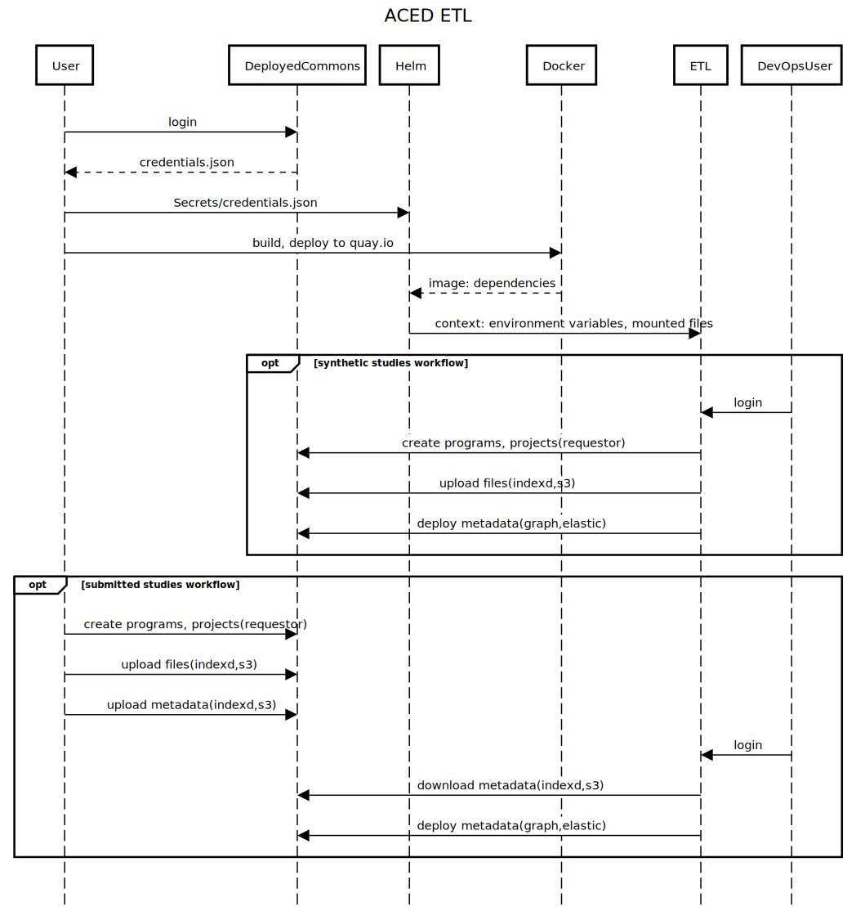

# etl
etl worker pod

## use case

> As an ACED devops engineer, in order to maintain the ACED datasets,I need to be able to run the ETL process on a regular basis, leveraging the environment provided to the etl k8s pod.


## design



## implementation

### Docker k8s pod image

See [docker/etl-docker.md](./docker/etl-docker.md)

### Assumptions:ETL image file structure

* All environments (local, staging, production):

  * The root home directory will have virtual environment with all dependencies loaded
    * aced_submission
    * gen3_util
    * iceberg
    * aws cli
    * jq, vi, curl, psql, etc. 
  
  * The Helm chart will mount the following directories into the ETL pod: 
    * `/creds` - contains all credential files required for the ETL process.
    * environmental variables
    * TODO how will the Helm chart configure ~/.aws directory
 
    The `/creds` directory contains all credential files required for the ETL process.

        ```
        /creds
        ├── credentials.json
        ├── sheepdog-creds
        │   ├── database -> ..data/database
        │   ├── dbcreated -> ..data/dbcreated
        │   ├── host -> ..data/host
        │   ├── password -> ..data/password
        │   ├── port -> ..data/port
        │   └── username -> ..data/username
        └── user.yaml
        ```
    The `~/.aws` directory will have:
  
   ```
        ~/.aws
        ├── config
        └── credentials
  
        # TODO: How will the Helm chart configure ~/.aws directory?
        cat ~/.aws/credentials
        [fencebot] 
        aws_access_key_id = YYYYY
        aws_secret_access_key = YYYYY
        [etlbot] 
        aws_access_key_id = YYYYY
        aws_secret_access_key = YYYYY

    ```
  
  * TODO: The Helm chart will make the `fence.ALLOWED_DATA_UPLOAD_BUCKETS` available Where? How?

* Staging/Production:
  * The ETL user will download ~/studies and ~/output from the S3 bucket.

* Local:
  * The ETL user can mount the local directories into the ETL pod at ~/studies and ~/output

          * `~/studies` - meta data files for the studies to be loaded into the Gen3 endpoint.
          * `~/output` - files to be loaded into indexd

## use

### Initializing programs and projects in the Gen3 endpoint 

```commandline
cd ~
source venv/bin/activate
gen3_util projects touch --all

```

### Testing fence's ability to sign URLs


```sh
# check to ensure aws setup correctly
grep default ~/.aws/credentials
grep fencebot ~/.aws/credentials  
echo 'this is a test' > test.txt

yq -rc '.ALLOWED_DATA_UPLOAD_BUCKETS[]  | "AWS_PROFILE=fencebot python3 ./put_signed_url  " + . + " test.txt put"  ' etl.yaml  | sh
```


### Download study data from s3

```sh
# copy data
aws s3 cp s3://aced-development/studies.zip . ; aws s3 cp s3://aced-development/output.zip .
# unzip data
unzip studies.zip ; unzip output.zip ; rm studies.zip ; rm output.zip  
```

### Loading files into indexd

```sh
# load all files and all metadata
load_studies  

```

### Truncating sheepdog data

```sh
TODO
```


## development

```commandline
cd ~
source venv/bin/activate

# validate we can talk to the Gen3 endpoint and create all projects we have access to
gen3_util projects touch --all

# setup ~/.aws/credentials file
grep default ~/.aws/credentials
grep fencebot ~/.aws/credentials

# validate that fence buckets exist and fencebot can write to them
echo 'this is a test' > test.txt
yq -rc '.ALLOWED_DATA_UPLOAD_BUCKETS[]  | "AWS_PROFILE=fencebot python3 ./put_signed_url  " + . + " test.txt put"  ' etl.yaml  | sh

# copy meta data config from iceberg
curl  https://raw.githubusercontent.com/bmeg/iceberg-schema-tools/main/config.yaml -o config.yaml


# copy data
aws s3 cp s3://aced-development/studies.zip . ; aws s3 cp s3://aced-development/output.zip .
# unzip data
unzip studies.zip ; unzip output.zip ; rm studies.zip ; rm output.zip 


# load all data


```