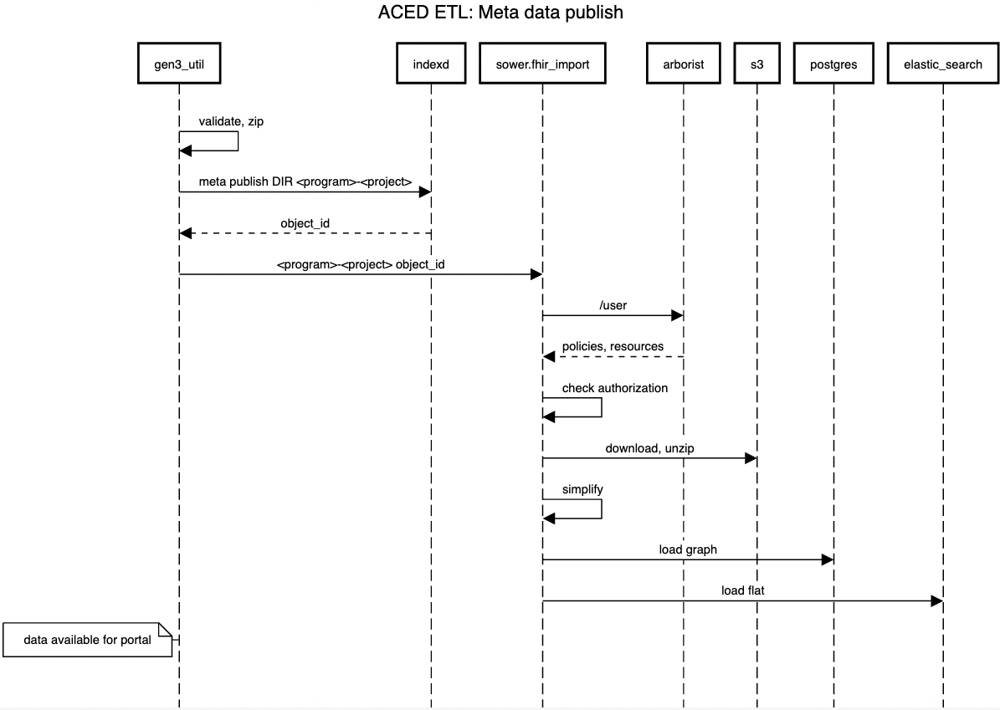

# etl
etl worker job/pod

## use case

> As an ACED devops engineer, in order to maintain the ACED datasets,I need to be able to run the ETL process on a regular basis, leveraging the environment provided to the etl k8s pod.


## Implementation: Docker k8s job/pod image
 


See [etl-job/README](./etl-job/README.md)

* The root home directory will have virtual environment with all dependencies loaded
  * aced_submission
  * gen3_util
  * iceberg
  * jq, vi, curl, psql, etc. 
  
* The Helm chart will mount the following directories into the ETL pod: 
  * environmental variables for database access etc.

> As an ACED analyst, in order to make the data available to researchers, I need to be able to upload files and associate them with a study, patient, specimen or observation

 
## Dependencies


* Before a project can be loaded, a user in the submitter role must create in the authorization system (Arborist)
  


* Before meta data can be generated, files must be uploaded to the data bucket and an object_id created in indexd

## Metadata generation


```commandline
# optionally edit the metadata
# files created from the previous step
ls -1 <DIR>
DocumentReference.ndjson
ResearchStudy.ndjson
```
## Metadata publication

Copy the metadata to the bucket and publish the metadata to the portal


