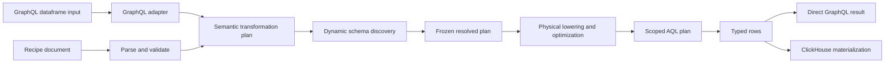
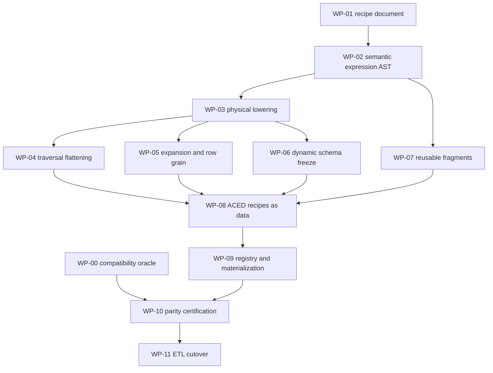

# Generic Loom recipe implementation plan

## Outcome

Loom will own a reusable, versioned recipe language capable of expressing the
current `gen3_tracker.meta.dataframer` translation as data. The ACED default
translation will be one checked-in recipe bundle containing five outputs:

- `DocumentReference`;
- `ResearchSubject`;
- `MedicationAdministration`;
- `Specimen`;
- `GroupMember`.

No production Go function may dispatch on those output names or contain
ACED-specific flattening rules. Loom provides generic recipe, expression,
traversal, expansion, schema-discovery, compilation, execution, and
materialization machinery. ACED behavior lives in the default recipe bundle.

The existing Python translator remains an external compatibility oracle until
the Loom implementation passes exact parity tests and the ETL cutover is
complete.

## Scope boundary

This work starts with an immutable READY Loom dataset generation. It does not
change:

- Sower job creation or input packets;
- Git checkout, Git-DRS hydration, or `forge meta`;
- the generation bulk-load contract;
- project/generation authorization semantics;
- active-generation publication;
- Guppy or Elasticsearch behavior before the explicit ETL cutover WP.

This work does change Loom's dataframe model, because the current selector,
aggregate, pivot, and slice vocabulary cannot express dynamic fields,
flatten-into-parent joins, or row explosion.

## Architectural invariants

The implementation must preserve these rules throughout every WP:

1. **Recipes are data.** A recipe contains no raw AQL, SQL, Go callback name,
   collection name, table name, or server filesystem path.
2. **One semantic model.** GraphQL requests, stored recipes, direct execution,
   validation, explanation, and ClickHouse materialization lower through the
   same semantic and physical IR.
3. **Storage scoping is structural.** Project, generation, and authorization
   predicates are applied to every root, edge, and related-resource scan by the
   compiler. A recipe cannot override them.
4. **Dynamic schemas are bounded.** Dataset-derived column names are discovered
   during preflight, sanitized, collision-checked, and frozen before row
   execution or ClickHouse table creation.
5. **Row identity is explicit.** Any operation that changes row multiplicity
   must declare the new row grain and deterministic identity expression.
6. **No hidden postprocessor.** Direct GraphQL rows and materialized rows must
   pass through the same compiled transformation plan. A compatibility-only Go
   map rewrite after query execution is not acceptable.
7. **Compatibility is measured.** Legacy equivalence is proven with fixture
   outputs, not inferred from similar-looking recipes.
8. **Versioning is immutable.** Recipe schema version, translation version,
   canonical recipe digest, source generation, and authorization-scope digest
   identify a materialized result.

## Target pipeline



The existing GraphQL dataframe input is a subset of the recipe language. It
continues to map into the same semantic plan without requiring callers to use
stored recipe documents.

## Recipe model

The public recipe document is a stable, versioned input format. The exact Go
types may evolve during WP-01 and WP-02, but the model must contain these
concepts.

```json
{
  "recipeSchemaVersion": 1,
  "name": "example-bundle",
  "translationVersion": "1",
  "outputs": [
    {
      "name": "members",
      "rootResourceType": "Group",
      "rowGrain": "group_member",
      "expand": {
        "from": {"select": "member[]"},
        "as": "member"
      },
      "identity": {
        "name": "id",
        "expr": {
          "call": "uuid5",
          "args": [
            {"literal": "aced-idp.org"},
            {"call": "concat", "args": [
              {"select": "root.id"},
              {"literal": ","},
              {"call": "reference_id", "args": [
                {"select": "member.entity.reference"}
              ]}
            ]}
          ]
        }
      },
      "fields": [
        {"name": "group_id", "expr": {"select": "root.id"}},
        {"name": "member_id", "expr": {
          "call": "reference_id",
          "args": [{"select": "member.entity.reference"}]
        }}
      ]
    }
  ]
}
```

This example is illustrative, not a schema commitment. WP-01 freezes the first
supported representation after compiler ergonomics and validation errors have
been exercised in tests.

## Generic operation vocabulary

The first recipe version needs only operations justified by the legacy
translation, but every operation must be generic.

### Expressions

- selector against a named row context;
- literal string, number, boolean, null, or bounded literal array;
- ordered `coalesce`;
- `first`, `all`, and `distinct` cardinality reduction;
- `concat` and `join`;
- explicit cast with declared failure/null behavior;
- `reference_id` for `ResourceType/id` references;
- final URL/path segment extraction;
- GraphQL-safe name sanitization;
- UUIDv3/UUIDv5 with explicit namespace and inputs;
- conditional `if`/`case` based on typed predicates;
- FHIR value normalization expressed by composing the preceding primitives.

FHIR-specific convenience macros may be provided by recipe libraries, but
they must expand into the generic expression AST before semantic validation.

### Row shaping

- project one named field;
- project a bounded object;
- traverse a generated FHIR relationship;
- flatten selected child fields into the parent row;
- namespace selected child fields;
- aggregate a related set;
- pivot with an explicit or discovered bounded column set;
- expand one repeated expression into rows;
- derive deterministic identity for an expanded row;
- discover key/value pairs and freeze them as bounded output columns.

### Collision behavior

Every operation capable of emitting the same column more than once must state
one of:

- `error`;
- `first`;
- `last`;
- `array`;
- `distinct_array`.

The ACED compatibility recipe may use `last` where the Python translator does,
but the compiler remains unaware that this is a legacy behavior.

## WP-00: establish the compatibility oracle

Repositories: `ACED-IDP/gen3_util` and Loom test tooling.

### Purpose

Freeze what “backwards compatible” means before Loom reimplements it.

### Work

1. Pin the exact `gen3_util` development commit used as the oracle.
2. Create a hermetic Python environment that can run the five existing
   dataframe generators without depending on a developer workstation.
3. Produce golden normalized JSON rows from:
   - existing `fhir-compbio-examples` fixtures;
   - existing FHIR-GDC fixtures;
   - Loom `META_SMALL`;
   - synthetic edge cases for every supported `value[x]` shape;
   - nested extensions;
   - zero, one, and multiple identifiers;
   - multiple codings and coding systems;
   - missing referenced subjects;
   - multiple observations producing the same field;
   - empty and multi-member Groups.
4. Record per output:
   - row count;
   - ordered column list;
   - row identity fields;
   - normalized rows sorted by identity;
   - JSON value types;
   - warnings and errors.
5. Add a fixture manifest containing source file digests and oracle commit.

### Deliverables

- `conformance/legacydataframer/` fixture runner and manifests in Loom;
- generated golden files checked into test data;
- one command that regenerates the oracle output intentionally.

### Acceptance gate

- a seeded change to identifier, value, extension, collision, and GroupMember
  behavior fails a focused golden comparison;
- normal CI compares against goldens but never silently regenerates them;
- the oracle container and fixture provenance are reproducible.

## WP-01: define the versioned recipe document

Repository: Loom.

Likely ownership: `internal/dataframe/recipe` for parsing and validation, with
public compatibility aliases only when external packages need them.

### Work

1. Define recipe bundle, output, field, traversal, expansion, identity,
   dynamic-column, and expression input types.
2. Decode JSON strictly:
   - reject unknown fields;
   - reject duplicate JSON object keys if the decoder permits detection;
   - reject unknown schema versions;
   - reject empty names and duplicate output/field names;
   - enforce depth and node-count limits.
3. Canonicalize validated documents and calculate a stable digest independent
   of insignificant JSON formatting.
4. Separate runtime bindings from stored recipe content:
   - project;
   - dataset generation;
   - requested authorization paths;
   - preview/result limit.
5. Add recipe explanation output containing the validated document structure
   without storage implementation details.

### Tests

- JSON round trips and canonical digest stability;
- unknown/duplicate fields;
- invalid versions;
- recursive depth limits;
- duplicate names;
- expressions with invalid arity or types;
- attempts to provide AQL, SQL, collection, or table names.

### Acceptance gate

- parsing requires no ArangoDB or ClickHouse;
- equivalent JSON documents produce the same digest;
- malformed documents return stable user-facing error codes and paths;
- the package contains no ACED resource/output names.

## WP-02: add a typed expression AST

Repository: Loom.

Likely ownership:

- public recipe expression inputs: `internal/dataframe/recipe`;
- compiler-neutral semantic expressions: `internal/dataframe/semantic` or
  `internal/dataframe/spec`;
- physical expression nodes: `internal/dataframe/compiler/ir`.

### Work

1. Define semantic expression nodes with explicit input/output types and
   cardinality.
2. Lower recipe input expressions into semantic expressions exactly once.
3. Validate function names, arity, argument types, null behavior, and
   cardinality before physical lowering.
4. Add generic functions required by the operation vocabulary.
5. Represent ordered fallback/coalesce directly instead of rewriting it into
   repeated selectors.
6. Reuse the existing generated FHIR schema to validate selector paths and
   terminal scalar types.
7. Extend explanation output with expression type, cardinality, source context,
   and fallback chain.

### Compatibility requirement

Existing `FieldSelect`, filter, aggregate, pivot, and slice requests must lower
into the new expression representation without changing their public GraphQL
contract or output semantics.

### Tests

- table-driven semantic typing for every expression;
- selector scalar/repeated cardinality;
- null propagation;
- invalid casts and malformed references;
- deterministic UUID and string composition;
- existing compiler semantic tests unchanged or intentionally adapted.

### Acceptance gate

- expressions are backend-independent;
- semantic validation catches invalid recipes before AQL rendering;
- no function dispatch depends on recipe or output name;
- all existing GraphQL dataframe tests remain green.

## WP-03: lower expressions through the physical IR and AQL renderer

Repository: Loom.

Likely ownership:

- `internal/dataframe/compiler/ir`;
- `internal/dataframe/compiler/lower`;
- `internal/dataframe/compiler/optimize`;
- `internal/dataframe/compiler/render/aql`.

### Work

1. Add physical nodes for generic function calls, conditionals, object
   projection, and typed cardinality reduction.
2. Lower every WP-02 semantic expression into physical IR.
3. Render each physical node as bind-safe AQL.
4. Keep all user strings in bind variables except compiler-owned field paths
   validated against generated schema metadata.
5. Extend scope validation so expressions may reference only contexts defined
   by their root/traversal/expansion plan.
6. Add optimizer rules for repeated selector/expression reuse without changing
   results.
7. Include physical expression counts and reuse decisions in diagnostics.

### Tests

- semantic-to-physical lowering snapshots;
- rendered AQL and bind-variable assertions;
- scope escape rejection;
- injection strings treated as values;
- direct execution against the existing Arango integration fixture;
- optimizer-on/off equivalence.

### Acceptance gate

- every recipe expression executes through physical IR;
- no recipe evaluation occurs through an untyped `map[string]any`
  postprocessor;
- rendered queries retain project, generation, and authorization predicates;
- existing compiler benchmarks do not regress beyond an agreed threshold.

## WP-04: implement generic traversal flattening

Repository: Loom.

### Purpose

Allow a recipe to select related resources and merge selected fields into the
current row using declared cardinality and collision rules.

### Work

1. Extend traversal semantics with an output mode:
   - namespaced child projection;
   - flatten into current row;
   - aggregate/pivot/slice as already supported.
2. Permit a bounded list of target resource types for polymorphic references.
3. Bind a named child context so field expressions can refer to the actual
   related resource.
4. Support explicit prefix expressions based on a literal or actual target
   resource type.
5. Require collision policy when more than one child can contribute a field.
6. Define deterministic child ordering before `first` or `last` reduction.
7. Apply authorization and generation scoping to every traversed edge and node.

### Tests

- optional one, required one, and many cardinalities;
- reverse and forward generated relationships;
- polymorphic subject references;
- flatten with literal and resource-type-derived prefixes;
- collision modes;
- deterministic ordering;
- unauthorized related nodes never contribute fields.

### Acceptance gate

- the compiler contains no hardcoded `subject_Patient`, `focus_Specimen`, or
  other ACED route;
- those routes can be expressed entirely in recipe data;
- direct and materialized rows use the same flattened projection names/values.

## WP-05: implement expansion and synthetic row grains

Repository: Loom.

### Purpose

Allow any repeated selector or related set to become the output row grain.

### Work

1. Add a semantic expansion node with:
   - source context;
   - repeated expression;
   - element alias;
   - parent context retention;
   - declared output grain;
   - deterministic identity expression.
2. Reject expansion of scalar expressions.
3. Reject two independent expansions unless explicit Cartesian semantics are
   added in a later recipe version.
4. Lower expansion to a physical row-producing `FOR` operation.
5. Validate that the identity expression is non-empty and derived only from
   available immutable values.
6. Carry the new row identity into cursoring, explanation, materialization, and
   diagnostics.

### Tests

- zero, one, and multiple elements;
- parent plus element field projection;
- deterministic UUIDv5 identity;
- duplicate identity rejection;
- pagination stability;
- Group members expressed without a Group-specific compiler branch.

### Acceptance gate

- `GroupMember` is expressible using generic expansion, reference, concat, and
  UUID functions;
- the compiler has no `GroupMember` special case;
- row identity remains stable across retry and materialization.

## WP-06: implement dynamic column discovery and freezing

Repository: Loom.

Likely ownership:

- discovery contract: `internal/dataframe/recipe` or
  `internal/dataframe/runtime`;
- catalog reads: `internal/catalog`;
- resolved schema model: `internal/dataframe/semantic`;
- materialization schema: `internal/dataframe/materialization`.

### Purpose

Support extension URL and Observation code/component values that become column
names, while keeping ClickHouse schemas fixed and execution deterministic.

### Work

1. Add a generic dynamic-map projection with:
   - bounded source set/context;
   - key expression;
   - value expression;
   - key sanitizer;
   - collision policy;
   - maximum discovered-column limit.
2. Perform preflight discovery within the exact project, generation, and
   authorization scope.
3. Sanitize and collision-check candidate names before execution.
4. Produce an immutable resolved recipe containing the frozen columns and
   resolved types.
5. Include the resolved schema digest in materialization identity.
6. Reject runtime keys not present in the frozen schema instead of mutating a
   READY table.
7. Cache discovery by generation, authorization-scope digest, recipe digest,
   and relevant source-node identity.

### Tests

- stable discovery ordering;
- URL-derived extension keys;
- Observation `code.text` and component keys;
- invalid/reserved names;
- sanitized-name collisions;
- column-limit enforcement;
- discovery/execution scope agreement;
- cache separation across generations and auth scopes.

### Acceptance gate

- a resolved recipe has a complete bounded schema before row streaming;
- direct execution reports the same columns as materialization;
- no row can add a column after schema freeze;
- unauthorized data cannot influence discovered column names.

## WP-07: define reusable recipe libraries and fragments

Repository: Loom.

### Purpose

Avoid copying large expression trees while keeping compiler primitives generic.

### Work

1. Add named recipe fragments/macros expanded during parsing or semantic
   preparation.
2. Make fragment expansion hygienic:
   - explicit parameters;
   - no implicit root alias capture;
   - depth/node-count limits after expansion;
   - source locations preserved in errors.
3. Implement generic fragments needed by the default translation:
   - identifier projection;
   - coding display/code fallback;
   - FHIR `value[x]` coalesce/formatting;
   - extension key/value extraction;
   - attachment projection;
   - reference ID extraction.
4. Keep fragments as versioned recipe data or declarative standard-library
   definitions. Do not implement them as output-name switches.

### Acceptance gate

- expanded recipes contain only WP-02 generic AST nodes;
- callers can inspect the fully expanded explanation;
- fragment version/digest contributes to the recipe digest;
- fragments are usable by non-ACED recipes.

## WP-08: encode `aced-default-v1` entirely as data

Repository: Loom.

Suggested location: `recipes/aced-default-v1/` with one bundle manifest and
reviewable output files/fragments.

### Work

1. Encode common simplification behavior through WP-07 fragments.
2. Encode five independent output recipes matching the current row grains.
3. Express all joins as generated traversal labels in recipe data.
4. Express polymorphic subject flattening through WP-04.
5. Express Observation/extension fields through WP-06 dynamic maps.
6. Express GroupMember through WP-05 expansion and a UUID expression.
7. Declare collision, null, cardinality, output prefix, identity, and type
   behavior explicitly.
8. Add a human-readable explanation/golden rendering for code review.

### Prohibited implementation

- `switch output.Name` in Go;
- `if resourceType == "Observation"` in the generic compiler;
- an ACED-specific HTTP handler;
- invoking Python from Loom production execution;
- recipe-provided raw AQL/SQL;
- an after-query map transformer used only by this bundle.

### Acceptance gate

- removing the `aced-default-v1` files removes all ACED translation behavior
  without changing Loom binaries;
- the generic engine has no references to the five output names;
- every output compiles, explains, discovers a schema, and executes against all
  compatibility fixtures.

## WP-09: add recipe registry, execution, and atomic materialization

Repository: Loom.

### Work

1. Add a recipe registry that loads built-in and operator-configured recipes by
   immutable name/version/digest.
2. Add service operations to:
   - validate;
   - explain;
   - preflight/resolve schema;
   - preview rows;
   - materialize a bundle;
   - inspect status and diagnostics.
3. Reuse the existing GraphQL transport for control-plane operations and small
   preview results. Do not upload bulk META through GraphQL.
4. Materialize all five bundle outputs into staging tables.
5. Publish the bundle atomically only when every output succeeds.
6. Preserve the prior published bundle on failure.
7. Make retries idempotent for source generation, auth-scope digest, recipe
   digest, and resolved-schema digest.
8. Record complete provenance in the materialization registry.

### Tests

- registry version selection;
- validate/explain without databases where possible;
- preview versus materialized row equivalence;
- partial bundle failure and rollback;
- idempotent retry;
- concurrent requests for the same/different identity;
- authorization at validation, discovery, execution, and read time.

### Acceptance gate

- no partial bundle becomes visible;
- the browser/API never receives a ClickHouse table name or SQL capability;
- the same resolved plan produces preview and materialized rows;
- provenance identifies the exact source and translation.

## WP-10: build cross-implementation parity certification

Repositories: Loom and the pinned Python oracle environment.

### Work

For each fixture and output, compare Python, direct Loom, and materialized Loom:

- exact row count;
- exact row identity set;
- exact column set and recorded order;
- exact JSON value and type;
- null, missing, and empty-string behavior;
- array order and duplicate behavior;
- dynamic extension/Observation columns;
- collision results;
- warnings and errors.

Produce a diff keyed by output, row identity, column, expected value/type, and
actual value/type. Run a small representative suite in pull requests and the
full suite in scheduled/release CI.

### Acceptance gate

- all committed fixtures pass exact parity;
- seeded mismatches produce actionable diffs;
- a recipe version cannot be promoted as default without a green full report;
- intentional behavior changes require a new translation version and reviewed
  golden update.

## WP-11: cut the ETL over to the Loom recipe bundle

Repository: `/Users/peterkor/Desktop/BMEG/calypr_etl_pod`.

### Work

1. Keep the existing generation bulk load.
2. Invoke default recipe bundle materialization for the READY generation.
3. Wait for atomic publication or fail the job before downstream refresh.
4. During shadow mode, compare Loom outputs with the existing Python outputs.
5. Switch downstream indexing/reads only after parity and operational gates are
   satisfied.
6. Remove `LocalFHIRDatabase`, Pandas, Python DataFramer, and raw export usage
   only after rollback has been exercised.
7. Preserve Sower, Git/DRS, Forge, project naming/prefixing, and refresh
   behavior until those contracts are separately changed.

### Acceptance gate

- the same Sower job produces the same five downstream datasets;
- failures never publish a partial translation or refresh downstream indices;
- rolling back a recipe version does not require reloading the source
  generation;
- the ETL image no longer needs Python DataFramer dependencies after final
  cutover.

## Dependency graph



WP-00 and WP-01 can start together. WP-04, WP-05, and the discovery-specific
parts of WP-06 can proceed in parallel after the expression/physical IR
boundary is stable. WP-08 must remain recipe-only work; if it exposes a missing
primitive, that primitive returns to the appropriate generic WP with generic
tests.

## Recommended implementation slices

These are mergeable slices, not separate architectures:

1. Recipe parsing, canonicalization, validation, and explanation.
2. Selector/literal/coalesce expression AST with existing GraphQL lowering.
3. Remaining generic functions and physical AQL rendering.
4. Flattened traversals with collision policy.
5. Expansion with synthetic identity.
6. Dynamic map discovery and schema freezing.
7. Reusable fragments and full ACED recipe data.
8. Registry, GraphQL control plane, and atomic materialization.
9. Parity certification and ETL shadow/cutover.

Each slice must keep existing GraphQL/compiler tests green and include its own
end-to-end fixture through semantic plan, physical plan, rendered AQL, and row
result where applicable.

## Definition of done

- Loom has a generic versioned recipe language and canonical digest.
- Stored recipes and GraphQL dataframe inputs share one semantic/physical
  compiler path.
- Generic expressions, traversal flattening, expansion, dynamic columns, and
  synthetic identity are supported without output-name dispatch.
- Dynamic schemas are authorization-scoped and frozen before execution.
- `aced-default-v1` contains all ACED behavior as recipe data.
- Direct and ClickHouse-materialized outputs are identical.
- The five outputs exactly match the pinned Python oracle fixtures.
- Bundle publication is atomic, idempotent, versioned, and fully attributable.
- The ETL can remove Python DataFramer dependencies without changing Sower or
  Git/DRS behavior.
