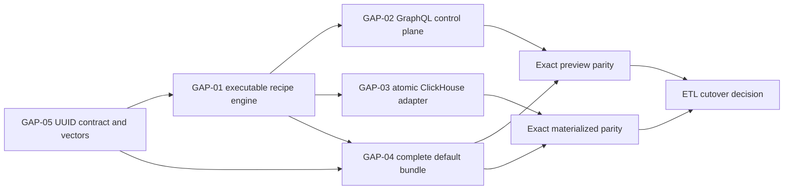

# Loom recipe final integration plan

## Outcome

Close the five remaining gaps between Loom's recipe compiler foundations and a
production replacement for `gen3_tracker.meta.dataframer`:

1. execute a resolved recipe physical plan against one scoped Loom dataset
   generation;
2. expose durable recipe lifecycle operations through GraphQL;
3. publish every output to ClickHouse atomically;
4. encode the complete legacy translation as versioned recipe data; and
5. make UUID3/UUID5 exactly compatible with the pinned legacy implementation.

This plan does not add another map evaluator, route raw FHIR bytes through
GraphQL, or add Go branches for the five legacy output names. The existing
generation multipart load and NDJSON export routes remain unchanged.

## Current implementation boundary

Loom already has:

- strict recipe documents, canonical digests, fragments, and the default
  bundle under `internal/dataframe/recipe`;
- typed expression and semantic recipe plans under
  `internal/dataframe/expression` and `internal/dataframe/semantic`;
- immutable dynamic-schema resolution in `ResolvedRecipePlan`;
- typed physical calls/literals and `lower.LowerResolvedRecipePlan`;
- a transport-neutral `recipecontrol.Service`;
- a durable recipe-store interface and Arango adapter;
- an `AtomicBundleStore` transaction contract; and
- boundary tests preventing production use of `recipeeval` and
  output-name-specific dispatch.

What is missing is the executable glue between those contracts and Loom's real
Arango, GraphQL, and ClickHouse services.

## Non-negotiable invariants

1. A production request resolves exactly one project, dataset generation,
   authorization-scope digest, recipe digest, fragment digest set, and resolved
   schema digest before row execution.
2. Discovery, preview, and materialization use the same scoped execution
   primitives and resolved plan.
3. Every Arango root, edge, and traversal-target read applies project,
   generation, and authorization predicates before projection.
4. No production package imports `recipeeval`.
5. No compiler, executor, GraphQL resolver, or materializer switches on a
   default recipe name, output name, or default resource type.
6. Recipe documents contain no AQL, SQL, collection names, physical table
   names, or credentials.
7. Runtime rows cannot introduce columns absent from the frozen resolved
   schema.
8. Readers see either the previous READY bundle or the complete new READY
   bundle, never a mixture.
9. UUID output is byte-for-byte identical to the pinned Python oracle.
10. ETL cutover remains blocked until direct preview and ClickHouse output both
    pass exact legacy parity.

## Shared production contracts

Add one compiler-backed execution service, likely under
`internal/dataframe/recipeengine`:

```go
type ExecutionIdentity struct {
    RecipeDigest        string
    ResolvedSchemaDigest string
    Project             string
    DatasetGeneration   string
    ScopeDigest         string
    EngineVersion       string
}

type ResolveRequest struct {
    RecipeName string
    Bindings   recipe.RuntimeBindings
}

type PreviewRequest struct {
    Plan  semantic.ResolvedRecipePlan
    Limit int
}

type OutputStream interface {
    Output() string
    Columns() []schema.Column
    Stream(context.Context, func(row.Row) error) error
}

type Engine interface {
    Resolve(context.Context, ResolveRequest) (semantic.ResolvedRecipePlan, error)
    Explain(context.Context, semantic.ResolvedRecipePlan) (Explanation, error)
    Preview(context.Context, PreviewRequest) (PreviewResult, error)
    Streams(context.Context, semantic.ResolvedRecipePlan) ([]OutputStream, error)
}
```

`recipecontrol`, GraphQL, and materialization must depend on this interface.
They must not reconstruct semantic plans, perform independent discovery, or
interpret recipe expressions themselves.

## GAP-01: storage-backed resolved-plan executor

Repository: Loom.

### Objective

Turn `semantic.ResolvedRecipePlan` and `lower.RecipePhysicalPlan` into scoped,
parameterized AQL and typed row streams using Loom's existing compiler,
catalog, Arango query, and authorization machinery.

### Ownership

- `internal/dataframe/recipeengine`: orchestration and public execution seam;
- `internal/dataframe/compiler/lower`: recipe physical operation lowering;
- `internal/dataframe/compiler/render/aql`: AQL rendering only;
- `internal/dataframe/runtime`: shared query execution and row streaming;
- `fhirschema`: generated selector/traversal facts;
- `internal/catalog`: bounded discovery queries.

### Work package 01A: freeze the executable physical model

1. Extend `RecipePhysicalPlan` so every output explicitly contains:
   - a root scan;
   - scoped traversal operations;
   - optional expansion loop;
   - derived expressions;
   - identity projection;
   - ordered static and dynamic projections; and
   - deterministic sort/cursor identity.
2. Reuse existing `PhysicalRootScan`, `PhysicalTraversal`,
   `PhysicalExpression`, and `PhysicalReturn` nodes wherever their semantics
   match. Add recipe-specific row-producing nodes only where the existing
   root-grain plan cannot represent expansion.
3. Make physical validation reject:
   - undefined variables or aliases;
   - collection/table literals from recipe data;
   - unscoped root, edge, or target scans;
   - scalar expansion sources;
   - two independent row-expanding loops;
   - missing or repeated expansion identity;
   - dynamic projections without a frozen column set; and
   - nondeterministic `first`, overwrite, or pagination operations.
4. Preserve source JSON paths and fragment invocation locations on every
   physical node for diagnostics.

### Work package 01B: traversal execution

1. Resolve each semantic traversal through
   `fhirschema.ResolveCompilerTraversal`.
2. Lower forward, reverse, and proven endpoint-lookup traversal strategies
   through the existing physical traversal machinery.
3. Apply the same project/generation/auth predicates to:
   - root documents;
   - edge documents; and
   - traversal targets.
4. Bind target documents to the semantic alias expected by typed field,
   identity, expansion, and dynamic-map expressions.
5. Define projection behavior generically:
   - namespaced object;
   - flatten into parent;
   - scalar/array reduction;
   - pivot/dynamic source; and
   - representative slice.
6. Sort many-valued traversal targets by immutable target identity before any
   order-sensitive reduction.
7. Reject flattening a many-valued traversal unless the recipe declares a
   reduction and collision policy.

### Work package 01C: expansion execution

1. Add a row-producing physical expansion operation rendered as an AQL `FOR`
   over the checked repeated source expression.
2. Retain both parent and element aliases inside projections and identity.
3. Emit zero rows for an empty expansion source.
4. Sort expansion elements by explicit recipe ordering or a stable canonical
   value/identity when source order is not semantic.
5. Require a required-one string/UUID identity and fail on duplicate identity
   within an output execution.
6. Use the expanded identity for cursor ordering, retries, preview pagination,
   ClickHouse row identity, and diagnostics.

### Work package 01D: dynamic discovery and row execution

1. Build discovery queries from the same physical traversal/expression
   lowering used for rows.
2. Cache discovery only by the complete tuple:
   - recipe digest;
   - generation;
   - scope digest;
   - semantic dynamic-source identity; and
   - schema/sanitizer algorithm version.
3. Freeze sorted keys and types into `ResolvedRecipePlan` before executing any
   output rows.
4. Render dynamic projections only for frozen keys.
5. Reject runtime keys missing from the frozen plan and values incompatible
   with the frozen logical type.
6. Return one typed row-stream descriptor per output. Preview and ClickHouse
   must consume these descriptors directly.

### Work package 01E: execution limits and diagnostics

1. Enforce preview limits before query execution.
2. Add configurable limits for root rows, traversal fan-out, expansion rows,
   dynamic columns, expression nodes, query time, and emitted bytes.
3. Propagate context cancellation through Arango cursors and row callbacks.
4. Return logical diagnostics only: recipe/output/source paths, inferred type,
   cardinality, row counts, and timing. Do not expose AQL or bind values over
   GraphQL.

### Tests

- optional/required and forward/reverse traversals;
- one/many and nested traversal aliases;
- unauthorized root, edge, and target exclusion;
- zero/one/many expansion elements;
- duplicate expanded identity;
- stable output under shuffled Arango cursor order;
- dynamic discovery scope/generation isolation;
- discovery/execution disagreement;
- cancellation and query-limit enforcement;
- equivalent preview and materialization streams;
- repository scan proving no output/resource-name dispatch.

### Acceptance gate

- the complete default bundle executes against a real Loom generation through
  the production compiler path;
- production execution does not import or call `recipeeval`;
- every AQL query is parameterized and scope-complete;
- preview and materialization receive identical typed output streams.

## GAP-02: GraphQL recipe control plane

Repository: Loom.

### Objective

Expose typed recipe lifecycle operations backed by `recipeengine.Engine` and
the durable registry. GraphQL carries bounded control documents and structured
results, never bulk FHIR data.

### Schema

Add operations:

```graphql
validateDataframeRecipe(input: ValidateDataframeRecipeInput!): DataframeRecipeValidation!
explainDataframeRecipe(input: ExplainDataframeRecipeInput!): DataframeRecipeExplanation!
preflightDataframeRecipe(input: PreflightDataframeRecipeInput!): DataframeRecipePreflight!
previewDataframeRecipe(input: PreviewDataframeRecipeInput!): DataframeRecipePreview!
materializeDataframeRecipeBundle(input: MaterializeDataframeRecipeInput!): DataframeRecipeExecution!
dataframeRecipeExecution(id: ID!): DataframeRecipeExecution
```

### Work package 02A: durable registry integration

1. Replace the control service's process-local `Get(string)` contract with a
   context-aware durable registry interface.
2. Persist immutable recipe versions by name, translation version, canonical
   recipe digest, and fragment dependency digests.
3. Register the built-in default bundle through the same path as submitted
   recipes during server bootstrap.
4. Make identical registration idempotent and reject name/version collisions
   with a different digest.
5. Add schema/bootstrap indexes for name/version, digest, and execution
   identity.

### Work package 02B: request resolution and authorization

1. Resolve the caller's project authorization before loading a recipe or
   generation.
2. Resolve an explicit generation or the active generation once and record it
   in the request identity.
3. Calculate the authorization-scope digest from the normalized effective
   scope, not from untrusted input strings.
4. Bound submitted recipe JSON by bytes, depth, nodes, outputs, traversals, and
   dynamic columns before parsing.
5. Reject preview/materialization if the generation changes between request
   resolution and execution.

### Work package 02C: resolver behavior

1. `validate` parses, expands fragments, validates, and type-checks without
   discovery or execution.
2. `explain` returns semantic types, cardinalities, aliases, source locations,
   row grain, identity, and declared schema behavior.
3. `preflight` performs scoped discovery and returns the resolved schema and
   digest without rows.
4. `preview` reuses the resolved plan, enforces a small server-owned row/cost
   limit, and returns ordered columns plus typed JSON rows.
5. `materialize` submits the same resolved-plan digest to the bundle
   materializer and returns its durable execution record.
6. `execution` exposes state, logical output diagnostics, provenance, and
   errors without physical tables, AQL, SQL, credentials, or bind variables.

### Work package 02D: stable API errors

Map internal errors to stable GraphQL extensions containing:

- code;
- user-safe message;
- recipe JSON path/source location;
- output name when applicable;
- retryability; and
- execution ID for asynchronous failures.

Do not serialize raw database errors to clients.

### Tests

- registry survival across server restart;
- built-in and submitted recipe equivalence;
- unauthorized project/generation;
- restricted-empty authorization scope;
- bounded JSON rejection;
- validation without storage reads;
- preflight/preview digest equality;
- preview/materialization digest equality;
- generation race detection;
- response redaction;
- resolver cancellation and cost limits;
- HTTP-level GraphQL integration tests for every operation.

### Acceptance gate

- a registered recipe can be validated, explained, preflighted, previewed,
  materialized, and inspected after server restart;
- preview and materialization reference the same resolved schema digest;
- no GraphQL response exposes a physical implementation detail.

## GAP-03: concrete atomic ClickHouse bundle publication

Repository: Loom.

### Objective

Implement `materialization.AtomicBundleStore` using ClickHouse staging tables
and an Arango-backed logical bundle pointer so all outputs publish as one
version.

### Durable state model

```text
PENDING -> PREFLIGHT -> LOADING -> VALIDATING -> READY
                                  \-> FAILED
```

Persist one bundle execution record and one child record per output. Readers
resolve only the bundle's READY logical pointer, never staging table names.

### Work package 03A: execution identity and idempotency

1. Derive an execution key from:
   - recipe/fragment digests;
   - resolved schema digest;
   - project and generation;
   - authorization-scope digest; and
   - engine version.
2. Return an existing READY execution for an identical key.
3. Join or report an identical in-flight execution instead of starting a
   duplicate.
4. Define competing-version behavior per logical bundle name with optimistic
   pointer compare-and-swap.

### Work package 03B: staging transaction adapter

1. Implement `BeginBundle` with an execution-scoped transaction object.
2. Create all staging tables from the complete frozen schemas before loading
   the first row.
3. Use physical table names derived only from server-generated execution IDs.
4. Stream output rows in bounded batches with explicit typed ClickHouse
   columns.
5. Disallow runtime `AddColumn`; schema widening after preflight is an error.
6. Record row count, byte count, identity min/max, and load timing per output.

### Work package 03C: validation and publication

1. Validate every staging table for:
   - expected columns/types/order;
   - resolved schema digest;
   - row count;
   - non-null stable identity; and
   - identity uniqueness.
2. Mark child outputs validated without exposing them to readers.
3. Atomically compare-and-swap the logical READY bundle pointer only after all
   children validate.
4. Mark the execution READY after the pointer update succeeds.
5. Preserve the previous READY pointer on any create, insert, validation, or
   publication failure.

### Work package 03D: rollback and recovery

1. On synchronous failure, mark the execution FAILED and enqueue every staging
   table for cleanup.
2. Make cleanup asynchronous, retryable, and observable without affecting the
   READY pointer.
3. On server startup, reconcile stale LOADING/VALIDATING executions by checking
   their durable leases and staging tables.
4. Define cancellation semantics: stop new inserts, close streams, mark FAILED,
   and preserve the previous READY bundle.
5. Garbage-collect superseded READY physical versions according to a retention
   policy only after readers can no longer reference them.

### Reader changes

1. Resolve bundle name to one READY execution record.
2. Resolve output name through that execution's child metadata.
3. Never accept a physical table name from a client.
4. Include recipe, generation, scope, schema, and engine provenance in reader
   metadata.

### Tests

- first/middle/last output failure;
- type and identity validation failure;
- commit/pointer CAS failure;
- previous READY preservation;
- identical retry and concurrent identical execution;
- competing recipe versions;
- cancellation and server interruption;
- stale-execution reconciliation;
- cleanup failure without accidental publication;
- readers never observing mixed output versions.

### Acceptance gate

- no partial bundle is externally visible;
- an identical retry is idempotent;
- every READY output has complete execution and resolved-schema provenance;
- existing dataframe readers resolve logical bundle metadata rather than
  client-supplied physical tables.

## GAP-04: complete default legacy translation recipe

Repository: Loom, with pinned `gen3_util` as the behavioral oracle.

### Objective

Replace the approximate single JSON file with a reviewable, versioned recipe
bundle that expresses all legacy behavior using generic fragments and policies.

### Bundle layout

Create a directory such as:

```text
internal/dataframe/recipe/bundles/aced_meta_default/
  bundle.json
  outputs/
    document_reference.json
    research_subject.json
    medication_administration.json
    specimen.json
    group_member.json
  fragments/
    identifiers.json
    codings.json
    values.json
    extensions.json
    observations.json
    references.json
    attachments.json
  goldens/
    explanation.json
    schemas/<fixture>.json
```

The loader assembles these data files generically and produces one canonical
expanded digest. File names are packaging only and cannot influence behavior.

### Work package 04A: build a legacy behavior inventory

1. Pin the exact `gen3_util` revision.
2. Trace every output column to its Python generator, helper, precedence rule,
   null/empty behavior, collision behavior, and ordering rule.
3. Record the inventory as a machine-readable matrix containing:
   - output/column;
   - source selectors/traversals;
   - fragment/policy owner;
   - expected logical type;
   - row identity;
   - fixture family; and
   - oracle source digest.
4. Reject any default column without an inventory entry and fixture.

### Work package 04B: finish reusable fragments

Implement as recipe data:

- official identifier precedence and additional identifier-system columns;
- coding display/code fallback with preferred-system ordering;
- every supported FHIR `value[x]` shape;
- quantity, range, ratio, and numeric conversion policies;
- recursive extension traversal and URL-key extraction;
- observation value/component key-value extraction;
- attachment projection;
- reference and final-path extraction;
- GraphQL-safe naming;
- repeated-note concatenation; and
- parent-reference joining.

Fragment expansion must preserve definition and invocation source locations,
include fragment versions/digests in plan provenance, and remain bounded by
depth/node limits.

### Work package 04C: encode the five outputs

Encode exact behavior for:

1. document attachments, subject/focus relationships, and related observations;
2. research-subject enrollment, patient flattening, and conditions;
3. medication dosage, timing, notes, subject, and regimen identifiers;
4. specimen parent relationships, patient flattening, and observations; and
5. group membership expansion and stable UUID identity.

Make legacy column ordering, overwrite/coalesce behavior, missing values,
empty-string normalization, and collisions explicit recipe policies.

### Work package 04D: fixture-driven completion

Build fixtures for:

- absent/one/many identifiers and codings;
- every supported value shape;
- nested and colliding extensions;
- observation components;
- attachments;
- optional/multiple related resources;
- medication timing/dosage variants;
- specimen parents;
- empty and repeated membership; and
- duplicate/collision/error cases.

For each fixture commit:

- pinned input digest;
- exact Python NDJSON;
- ordered column/type manifest;
- Loom explanation golden;
- Loom resolved-schema golden; and
- direct and ClickHouse Loom outputs after the executor exists.

### Tests

- bundle assembly and canonical digest stability;
- fragment reuse outside the default bundle;
- full behavior-inventory coverage;
- no default output/resource names in production Go dispatch;
- exact rows, identities, columns, order, values, and JSON types against Python;
- default bundle removal leaving the generic engine tests green.

### Acceptance gate

- every known Python behavior maps to a recipe fragment/policy and fixture;
- the bundle compiles, discovers, explains, previews, and materializes without
  default-specific Go code;
- direct and ClickHouse outputs exactly match the pinned Python oracle.

## GAP-05: exact UUID3/UUID5 compatibility

Repository: Loom.

### Objective

Replace the current textual hash approximation with RFC-compatible UUID3/UUID5
semantics identical to Python `uuid.uuid3`/`uuid.uuid5` and the legacy
DataFramer's namespace construction.

### Required semantic contract

Define one operator contract before changing rendering:

```text
uuid3(namespace, part1, ... partN)
uuid5(namespace, part1, ... partN)
```

Specify:

- whether `namespace` must be a UUID or may be a name resolved under a fixed
  namespace;
- how name parts are converted to bytes and joined;
- Unicode normalization and UTF-8 encoding;
- null and empty-part behavior;
- MD5 versus SHA-1;
- RFC version and variant bits; and
- lowercase canonical output formatting.

The specification must be derived from the pinned Python call sites, not the
current approximate recipe or Go evaluator.

### Work package 05A: oracle vectors

1. Extract every legacy UUID call site and namespace derivation.
2. Generate committed vectors covering:
   - DNS/OID/URL/X500 namespaces;
   - derived namespace names;
   - ASCII, Unicode, empty, slash, comma, and multi-part names;
   - UUID3 and UUID5;
   - the exact membership identity inputs; and
   - malformed namespace/error behavior.
3. Record Python version, oracle commit, source digest, namespace UUID bytes,
   name bytes, and expected canonical UUID.

### Work package 05B: typed operator implementation

1. Add a shared pure implementation used by:
   - semantic constant folding;
   - reference/differential tests; and
   - any server-side post-query operation explicitly permitted by the physical
     contract.
2. Prefer physical execution in Arango only if AQL can reproduce namespace-byte
   hashing and RFC bit manipulation exactly.
3. If stock AQL cannot do so safely, add a compiler-owned execution operator
   with an explicit typed boundary; do not emit an approximate AQL expression.
4. Reject unsupported dynamic namespace forms at semantic validation rather
   than silently changing output.
5. Remove or fail the current `MD5/SHA1(CONCAT(text...))` renderer path once the
   exact implementation is active.

### Work package 05C: cross-runtime differential tests

For every vector compare:

- Python oracle;
- Loom pure operator;
- rendered/executed Arango result when AQL-backed; and
- final ClickHouse value.

Test constant and row-derived names separately. Run vectors in CI without
requiring Python regeneration.

### Acceptance gate

- every committed vector matches exactly in all active execution paths;
- membership identities match legacy outputs on real fixtures;
- no approximate textual-hash UUID path remains reachable in production.

## Recommended execution order



Implementation sequence:

1. Freeze UUID semantics and committed oracle vectors.
2. Implement the storage-backed recipe engine, including traversal, expansion,
   discovery, and typed row streaming.
3. Wire GraphQL and ClickHouse in parallel against the engine interface.
4. Complete the default bundle and fixtures incrementally as engine features
   land.
5. Run direct-preview and ClickHouse parity suites against the pinned oracle.
6. Only then replace the baby-step Loom-export/Python-DataFramer ETL path.

## Merge and verification strategy

Use small vertical merges that keep existing GraphQL dataframe, generation
load/export, and materialization tests green:

1. UUID specification and vectors.
2. Physical traversal/expansion IR validation.
3. Scoped AQL renderer and engine streaming.
4. Scoped discovery and resolved-schema enforcement.
5. Durable registry plus GraphQL validate/explain/preflight.
6. GraphQL preview.
7. Atomic ClickHouse staging/pointer adapter.
8. Default fragments and output documents by fixture family.
9. Real direct-preview parity.
10. Real ClickHouse parity and recovery tests.

Every merge must run:

```bash
GOCACHE=/tmp/loom-gocache GOTOOLCHAIN=auto go test ./...
```

Executor/materialization merges must additionally run integration tests against
real ArangoDB and ClickHouse. Default-recipe merges must run the committed
oracle fixtures without regenerating them in CI.

## Definition of done

- A registered recipe survives restart and resolves against one immutable,
  authorized Loom generation.
- Validate, explain, preflight, preview, materialize, and execution-status
  GraphQL operations use one engine and one resolved-plan digest.
- The production engine executes all five default outputs without
  `recipeeval` or default-specific Go dispatch.
- Every dynamic schema is frozen before row execution.
- UUID3/UUID5 exactly match the pinned Python implementation.
- ClickHouse readers cannot observe a partial or mixed bundle version.
- Direct Loom preview and ClickHouse outputs exactly match the pinned Python
  oracle for the real fixture corpus.
- The ETL can remove the Python DataFramer only after those gates pass.
