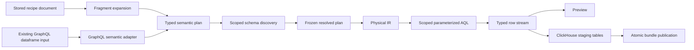
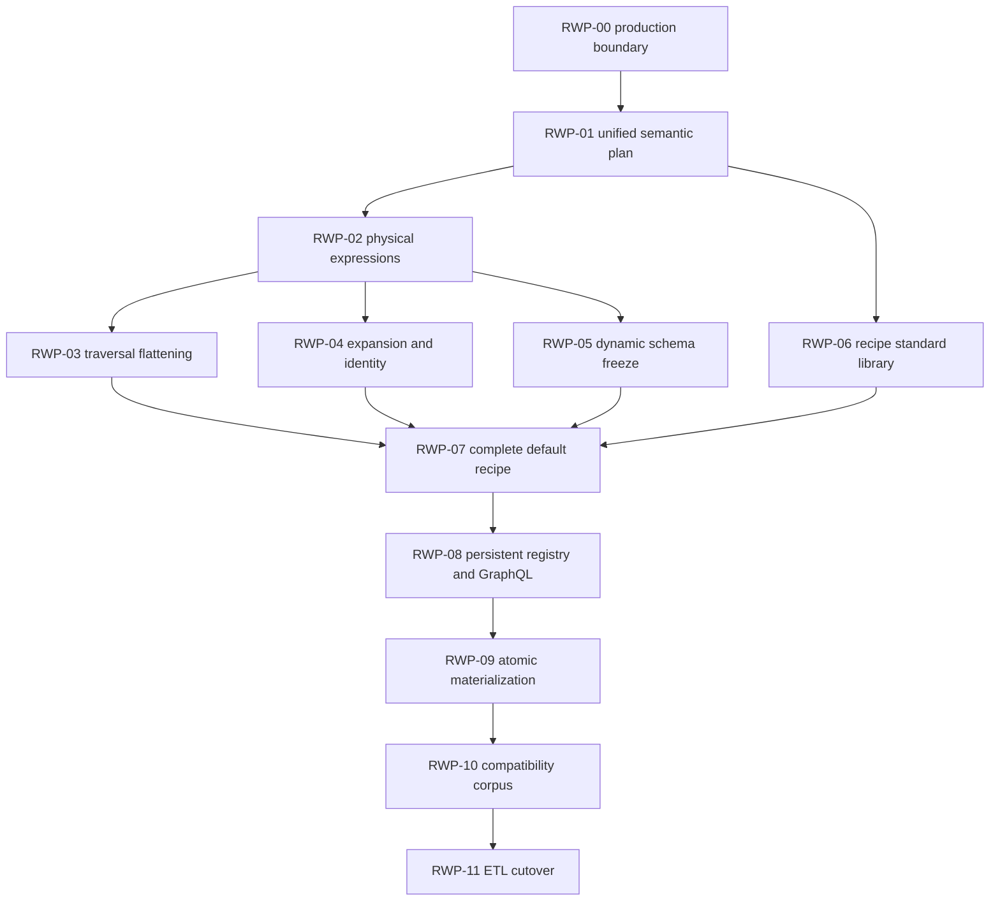

# Loom recipe production completion plan

## Outcome

Complete the generic Loom recipe system so the checked-in default translation
can replace `gen3_tracker.meta.dataframer` without embedding legacy output
behavior in Go.

The completed production path will:

1. resolve a versioned recipe against one immutable Loom dataset generation;
2. type-check every selector and expression against generated FHIR metadata;
3. discover and freeze any dataset-derived output columns within the caller's
   authorization scope;
4. lower the resolved recipe through Loom's semantic and physical IR;
5. execute scoped AQL directly against the loaded generation;
6. stream the same typed rows to preview and ClickHouse materialization;
7. publish all outputs atomically; and
8. prove exact parity against the pinned Python implementation before ETL
   cutover.

This is a production compiler and execution plan. It does not extend the
current map-based evaluator into a second runtime, and it does not add
resource-name or output-name cases to Loom.

## Current baseline

The first implementation pass established useful foundations:

- strict recipe parsing, validation, canonical JSON, and digesting in
  `internal/dataframe/recipe`;
- a backend-neutral typed expression AST in
  `internal/dataframe/expression`;
- a selector/traversal adapter in `internal/dataframe/recipecompile`;
- a storage-neutral reference evaluator in `internal/dataframe/recipeeval`;
- an in-memory immutable registry and all-output runner in
  `internal/dataframe/recipeexec`;
- a checked-in five-output recipe document;
- a generic NDJSON comparison harness in
  `conformance/legacydataframer`.

Those pieces do not yet form the production translation path:

- `recipecompile.CompileBundle` rejects expansion, custom identity, dynamic
  columns, and most composed expressions;
- `recipeeval` evaluates untyped `map[string]any` values after resource
  retrieval and is not connected to Loom's scoped physical compiler;
- there is no storage-backed recipe root/traversal resolver;
- dynamic discovery does not produce an immutable compiler input;
- recipe registration is process-local;
- no GraphQL control-plane operation exposes validate, explain, preview, or
  bundle materialization;
- the default recipe does not yet encode the full legacy simplification rules;
- the conformance fixture is a harness smoke fixture, not a real parity corpus;
- ClickHouse publication is not atomic across all bundle outputs.

## Architectural decision

Production execution must use one compiler path:



`recipeeval` remains useful as a small reference interpreter for unit tests and
compiler differential tests. It must not be used by the server's production
preview or materialization path. Production must not fetch broad resource maps
and then reproduce DataFramer logic in Go.

## Non-negotiable invariants

1. Recipe behavior is data. Removing the default recipe files removes the
   default translation behavior without changing the Loom binary.
2. No generic package may switch on recipe name, output name, or an ACED
   resource type.
3. Recipe documents cannot contain AQL, SQL, collection names, table names, or
   filesystem paths.
4. Project, generation, and authorization predicates are compiler-owned and
   applied to every root, edge, traversal target, and discovery query.
5. Every expression is typed before physical lowering. The production runtime
   cannot perform arbitrary type-dependent `map[string]any` rewrites.
6. Operations changing row multiplicity declare a row grain and stable
   identity.
7. Dataset-derived columns are frozen before row execution and ClickHouse table
   creation.
8. Preview and materialization consume the same resolved physical plan.
9. A bundle is visible only when every output is READY.
10. Compatibility is certified by exact fixture comparison, not by recipe
    review or similar-looking output.

## Production data structures

The implementation should converge on three distinct representations.

### Stored recipe

The current versioned JSON document remains persistence-neutral. It contains
logical operations and fragment references but no resolved schema facts or
runtime bindings.

### Semantic recipe plan

Add a compiler-owned model, likely under `internal/dataframe/semantic`, with at
least:

```go
type RecipePlan struct {
    Version            int
    RecipeDigest       string
    TranslationVersion string
    Bindings           RuntimeBindings
    Outputs            []OutputPlan
}

type OutputPlan struct {
    Name           string
    Root           SemanticNode
    RowGrain       RowGrain
    Identity       SemanticExpression
    Expansion      *SemanticExpansion
    Fields         []SemanticProjection
    DynamicMaps    []SemanticDynamicMap
    Collision      CollisionPolicy
    DeclaredOrder  []string
}
```

All recipe expressions must be converted to the existing typed expression AST
and checked exactly once. Existing GraphQL dataframe inputs should also be
adapted into this representation so semantic meaning is not duplicated.

### Resolved recipe plan

Discovery produces a new immutable plan rather than mutating the stored recipe:

```go
type ResolvedRecipePlan struct {
    SemanticPlan        RecipePlan
    ResolvedColumns     map[string][]ResolvedColumn
    ResolvedSchemaDigest string
    ScopeDigest         string
    SourceGeneration    string
}
```

This is the only recipe representation accepted by physical lowering and
materialization.

## RWP-00: lock the production boundary

Repository: Loom.

### Work

1. Mark `recipeeval` as a reference/conformance interpreter in package docs.
2. Add an import-boundary test preventing `internal/server`, `graphqlapi`,
   `runtime`, and `materialization` from importing `recipeeval`.
3. Replace the broad `recipeexec.Roots` callback as the intended production
   seam with a compiler service interface accepting a `ResolvedRecipePlan`.
4. Keep the existing runner only for unit fixtures until the compiler-backed
   service replaces it.
5. Add a repository test that rejects production switches/comparisons against
   the five default output names.

### Acceptance gate

- no production server path imports the map evaluator;
- future work has one explicit semantic-to-physical integration point;
- the reference evaluator remains usable for differential unit tests.

## RWP-01: unify recipe and GraphQL semantic lowering

Repository: Loom.

Likely ownership:

- `internal/dataframe/recipecompile` for input adaptation;
- `internal/dataframe/expression` for wire-expression conversion;
- `internal/dataframe/semantic` for the unified plan;
- `fhirschema` for selector type/cardinality resolution.

### Work

1. Convert every stored recipe expression into a typed semantic expression.
2. Resolve named contexts (`root`, traversal aliases, expansion aliases, and
   dynamic-map item aliases) lexically.
3. Reject undefined aliases, alias shadowing, and references outside their
   scope.
4. Resolve selector terminal type and cardinality through generated FHIR schema
   metadata.
5. Represent null behavior, missing behavior, and cardinality reduction
   explicitly on semantic nodes.
6. Adapt existing GraphQL `FieldSelect`, fallback, aggregate, pivot, slice, and
   traversal inputs into the same expression and output-plan types.
7. Extend explanation output with inferred type, cardinality, context, source
   path, and source-location information.
8. Remove the current rich-expression rejection once all recipe nodes can
   produce a valid semantic plan.

### Tests

- every expression operation with scalar, optional, and repeated inputs;
- valid and invalid alias scope;
- generated-schema path/type resolution;
- recipe versus equivalent GraphQL semantic-plan equality;
- stable error code, JSON path, and source location;
- recursion and node-count limits after fragment expansion.

### Acceptance gate

- the complete default recipe builds a typed semantic plan;
- no physical/backend package is imported during semantic validation;
- equivalent GraphQL and recipe inputs have equivalent semantic plans.

## RWP-02: add complete physical expression lowering

Repository: Loom.

Likely ownership:

- `internal/dataframe/compiler/ir`;
- `internal/dataframe/compiler/lower`;
- `internal/dataframe/compiler/optimize`;
- `internal/dataframe/compiler/render/aql`.

### Physical operators

Add typed physical nodes for:

- literal and bind-variable values;
- selector extraction from a named context;
- ordered `coalesce`;
- `first`, `all`, and `distinct`;
- concatenation and join;
- explicit cast with null/error policy;
- final path/reference segment extraction;
- name sanitization where the result is a value, not an AQL identifier;
- UUIDv3 and UUIDv5 with explicit namespace and ordered inputs;
- typed predicates and `if`/`case`;
- bounded object projection;
- deterministic sort/reduction of repeated child values.

### Work

1. Lower each checked semantic expression to physical IR without operation-name
   fallthrough.
2. Validate context availability at every physical node.
3. Render parameterized AQL; recipe literals remain bind variables.
4. Permit dynamic field access only for compiler-validated generated schema
   paths or frozen discovered columns.
5. Add expression common-subexpression reuse keyed by semantic identity and
   context.
6. Record operator counts, reused expressions, and rejected optimization
   reasons in diagnostics.
7. Make optimizer-disabled execution available for equivalence tests.

### Tests

- semantic-to-physical snapshots for every operator;
- bind-variable assertions with injection-like strings;
- rendered AQL syntax tests;
- optimizer enabled/disabled row equality;
- Arango integration tests using real nested FHIR values;
- no raw recipe string appears as executable AQL text.

### Acceptance gate

- every non-row-producing default-recipe expression renders and executes as
  physical AQL;
- no expression is evaluated after query execution in production;
- project, generation, and authorization scope validation still passes.

## RWP-03: implement generic traversal contexts and flattening

Repository: Loom.

### Work

1. Resolve recipe traversal labels through `fhirschema` generated relationship
   metadata.
2. Bind the target resource to its declared alias in the semantic plan.
3. Support forward, reverse, and safe endpoint-lookup strategies through the
   existing physical traversal machinery.
4. Add projection modes:
   - namespaced object/field projection;
   - flatten into parent;
   - aggregate into scalar/array;
   - pivot/dynamic map source;
   - representative slice.
5. Require explicit reduction and collision policy for many-valued flattened
   traversals.
6. Define deterministic child ordering from immutable target identity before
   `first`, `last`, or overwrite-style reduction.
7. Support polymorphic references through a bounded generated target-type set.
8. Apply project, generation, and authorization predicates to edge and target
   documents before any projection or column discovery.

### Tests

- optional and required traversals;
- forward and reverse relationships;
- one and many targets;
- polymorphic subject targets;
- nested traversal aliases;
- every collision policy;
- unauthorized edge and target exclusion;
- traversal results identical in preview and materialization.

### Acceptance gate

- all default-recipe relationships are declared only in recipe data;
- no compiler case references a concrete default traversal label;
- flattened output is deterministic under different Arango cursor orders.

## RWP-04: implement expansion and synthetic row identity

Repository: Loom.

### Semantic model

An expansion must declare:

- repeated source expression;
- element alias;
- retained parent contexts;
- output row grain;
- identity expression;
- duplicate-identity policy, initially `error` only.

### Work

1. Add `SemanticExpansion` and a row-producing physical `FOR` operator.
2. Reject scalar sources and unbounded Cartesian combinations.
3. Carry parent and element contexts into field and identity expressions.
4. Type-check identity as a required scalar string/UUID.
5. Validate identity inputs come from immutable source fields or literals.
6. Detect duplicate identities before materialization publication.
7. Carry expanded identity through cursor ordering, pagination, diagnostics,
   schema metadata, and ClickHouse row identity.
8. Define stable zero-element behavior: zero output rows, not one null row.

### Tests

- zero, one, and many expansion elements;
- stable parent-plus-element UUID identity;
- source-order independence where recipe ordering is unspecified;
- duplicate identities;
- pagination and retry stability;
- a generic group-like fixture with no Group-specific compiler logic.

### Acceptance gate

- the default membership output executes through physical expansion;
- its identity is stable across preview, retry, and materialization;
- the compiler contains no membership-output special case.

## RWP-05: implement scoped dynamic schema discovery

Repository: Loom.

Likely ownership:

- `internal/dataframe/semantic` for dynamic-map meaning;
- `internal/catalog` for bounded discovery queries;
- `internal/dataframe/runtime` for resolution orchestration;
- `internal/dataframe/materialization` for frozen schemas.

### Discovery protocol

For each dynamic map:

1. execute its source and key expression using the exact project, generation,
   and authorization scope;
2. sanitize keys using one versioned algorithm;
3. resolve collisions according to the declared policy;
4. infer or validate the value type;
5. sort columns deterministically;
6. enforce the configured maximum;
7. freeze the columns into `ResolvedRecipePlan`; and
8. calculate `ResolvedSchemaDigest`.

### Work

1. Add a discovery-only physical plan that shares expression and traversal
   lowering with row execution.
2. Ensure unauthorized resources cannot contribute a key or type observation.
3. Make discovery cache keys include recipe digest, generation, scope digest,
   semantic source identity, and schema-algorithm version.
4. Reject a runtime key absent from the frozen plan.
5. Reject incompatible values instead of widening a READY ClickHouse column.
6. Preserve declared output-column ordering, with dynamic groups inserted at
   their recipe-declared position and keys sorted within the group.
7. Expose discovered columns and provenance in explanation/preflight output.

### Tests

- extension URL keys;
- observation code/component keys;
- reserved and invalid names;
- two raw keys sanitizing to one name;
- mixed observed value types;
- column limit;
- generation and scope cache isolation;
- discovery/execution disagreement;
- deterministic schema digest.

### Acceptance gate

- every output has a complete immutable schema before streaming rows;
- direct and materialized execution report identical columns and types;
- runtime execution cannot add a column.

## RWP-06: add a declarative recipe standard library

Repository: Loom.

### Purpose

Encode repetitive FHIR simplification as reusable recipe data without teaching
the compiler about particular FHIR resources or legacy outputs.

### Required fragments

- zero/one/many identifier projection with official-identifier precedence;
- coding display with code fallback and optional preferred-system ordering;
- all supported FHIR `value[x]` shapes;
- quantity/range/ratio formatting and explicit numeric conversion policy;
- recursive extension traversal and URL-derived keys;
- observation top-level value and component key/value extraction;
- attachment field projection;
- reference ID extraction;
- final URL segment extraction;
- GraphQL-safe name sanitization;
- repeated-note concatenation;
- parent-reference joining.

### Work

1. Define versioned fragments as recipe documents, not Go callbacks.
2. Add explicit parameters and lexical context bindings.
3. Expand fragments before semantic type checking.
4. Preserve source locations from fragment definition and invocation.
5. Include fragment name, version, and digest in the expanded recipe digest.
6. Enforce expanded depth and node limits.
7. Permit resource-neutral configuration such as preferred coding system,
   collision policy, separator, or value precedence.
8. Add standalone fixtures proving every fragment can be reused outside the
   default bundle.

### Acceptance gate

- fully expanded recipes contain only generic expression/traversal/expansion/
  dynamic-map nodes;
- no fragment is selected by output or resource name in Go;
- all legacy normalization primitives are representable compositionally.

## RWP-07: complete the default translation as recipe data

Repository: Loom.

### Work

1. Replace the current approximate default document with a reviewable bundle
   directory containing:
   - bundle manifest;
   - one output document per row grain;
   - referenced standard-library fragments;
   - expanded explanation golden;
   - resolved-schema goldens per fixture.
2. Encode exact legacy behavior for:
   - identifiers and additional identifier-system columns;
   - scalars and null/missing handling;
   - codings and preferred coding systems;
   - all supported `value[x]` forms;
   - nested extensions;
   - observation components and collision ordering;
   - document attachments and related observations;
   - subject flattening and related conditions;
   - medication-specific dosage, timing, notes, and regimen identifiers;
   - specimen parents and related observations;
   - membership expansion and UUID identity;
   - legacy column ordering and empty-string normalization.
3. Make every legacy quirk explicit as recipe policy or standard-library
   parameter.
4. Add recipe validation tests that scan production Go packages for forbidden
   default output names.

### Acceptance gate

- the default bundle compiles, discovers, explains, and executes without a
  default-specific Go path;
- removing the bundle leaves the generic engine and tests intact;
- every known legacy behavior has an owning recipe fragment and fixture.

## RWP-08: persistent registry and GraphQL control plane

Repository: Loom.

### Registry identity

Persist recipes and executions by:

- recipe name and translation version;
- canonical recipe digest;
- fragment dependency digests;
- source project and generation;
- authorization-scope digest;
- resolved schema digest;
- engine/compiler version.

### GraphQL operations

Add typed operations for:

- `validateDataframeRecipe`;
- `explainDataframeRecipe`;
- `preflightDataframeRecipe`;
- `previewDataframeRecipe`;
- `materializeDataframeRecipeBundle`;
- `dataframeRecipeExecution`.

Recipe JSON may be submitted as a bounded control document or referenced by
registered name/version. Raw META bytes remain on the bulk HTTP route.

### Work

1. Replace the process-local registry with persistent metadata storage.
2. Load built-in recipes through the same registration path as operator
   recipes.
3. Resolve active generation and authorization scope before preflight.
4. Return stable validation errors and structured compiler diagnostics.
5. Limit preview rows and execution cost.
6. Prevent GraphQL responses from exposing AQL, SQL, physical table names, or
   credentials.
7. Make idempotency keys derive from the complete execution identity.

### Acceptance gate

- server restart does not lose registered versions or execution status;
- built-in and operator recipes use identical validation/execution paths;
- GraphQL preview and materialization reference the same resolved plan digest.

## RWP-09: atomic multi-output ClickHouse publication

Repository: Loom.

### State model

```text
PENDING -> PREFLIGHT -> LOADING -> VALIDATING -> READY
                                  \-> FAILED
```

The bundle registry points readers only to the previous READY bundle or the new
READY bundle. Staging output tables are never individually visible.

### Work

1. Create all output schemas from the frozen resolved plan.
2. Stream each output into an execution-specific staging table.
3. Validate row count, identity uniqueness, column types, and schema digest.
4. Record per-output diagnostics without publishing partial success.
5. Atomically update the logical bundle pointer after every output validates.
6. Preserve the previous READY pointer on any failure.
7. Drop failed staging tables asynchronously with retryable cleanup state.
8. Make identical retries return the existing READY execution.
9. Define concurrency behavior for identical and competing recipe versions.

### Tests

- failure on first, middle, and last output;
- process interruption during load and validation;
- previous READY bundle preservation;
- idempotent retry;
- two concurrent identical executions;
- concurrent distinct recipe versions;
- cleanup failure without accidental publication.

### Acceptance gate

- readers cannot observe a mixed bundle version;
- a failure never changes the READY bundle pointer;
- provenance and resolved schema are available for every READY output.

## RWP-10: build the real compatibility corpus

Repositories: Loom and a pinned `gen3_util` oracle environment.

Pinned oracle commit:

```text
d461f11c7f0ccb078128349ccffd377e4014b62a
```

### Corpus

Generate legacy and Loom outputs from:

- Loom `META_SMALL`, reduced to a reviewable deterministic subset where
  necessary;
- FHIR-GDC fixtures;
- fhir-compbio examples;
- synthetic resources covering every `value[x]` form;
- nested and repeated extensions;
- zero, one, and many identifiers;
- preferred and fallback coding systems;
- absent and polymorphic subjects;
- duplicate dynamic keys and collision ordering;
- attachments and multiple contents;
- medication dosage/timing/note variants;
- specimen parents;
- empty, one-member, and multi-member groups;
- invalid or missing related references.

### Work

1. Add a hermetic oracle runner pinned by lockfile/container digest.
2. Record source file digests and exact oracle commit.
3. Generate normalized NDJSON plus ordered column/type manifests.
4. Run the production Loom preview path, not `recipeeval`, for actual results.
5. Run the ClickHouse materialized path and compare it independently.
6. Diff by output, row identity, column, JSON value, JSON type, and column
   position.
7. Record warnings and failures as part of the observable contract.
8. Run a small corpus on pull requests and the full corpus on schedule/release.

### Acceptance gate

- seeded identifier, coding, extension, observation, collision, and membership
  changes fail with precise diffs;
- direct Loom and ClickHouse rows both exactly match the oracle;
- CI never regenerates goldens implicitly.

## RWP-11: shadow deployment and ETL cutover

Repository: `/Users/peterkor/Desktop/BMEG/calypr_etl_pod`.

### Phase A: shadow

1. Keep the existing Loom generation load and generation-scoped NDJSON export.
2. Run the existing Python DataFramer and publication path unchanged.
3. Trigger Loom recipe materialization for the same READY generation.
4. Compare execution summaries and selected full outputs.
5. Do not route downstream reads to Loom materializations.

### Phase B: guarded publication

1. Require a promoted recipe version and green parity certification.
2. Materialize the bundle and wait for atomic READY status.
3. Preserve the Python path as a rollback option.
4. Switch downstream publication only after the Loom bundle is READY.
5. Prevent Guppy/Elasticsearch refresh after partial or failed translation.

### Phase C: removal

1. Exercise recipe-version rollback without reloading the source generation.
2. Remove raw Loom export from the normal ETL path.
3. Remove `LocalFHIRDatabase`, Pandas, and Python DataFramer dependencies.
4. Preserve Sower packets, Git/DRS hydration, `forge meta`, project naming, and
   source generation loading.
5. Remove the shadow comparison only after an agreed operational window.

### Acceptance gate

- the same Sower job produces the same five certified datasets;
- rollback changes only the promoted recipe/materialization pointer;
- source data is not reloaded to retry or roll back translation;
- the ETL image no longer includes legacy DataFramer dependencies.

## Dependency graph



RWP-03, RWP-04, and the discovery-query portion of RWP-05 can proceed in
parallel after the semantic and physical expression contracts stabilize.
RWP-06 can proceed alongside physical work once the semantic expression and
fragment-expansion contracts are fixed. RWP-07 remains recipe-data work; any
missing capability discovered there must be implemented as a generic primitive
with generic tests in the appropriate earlier work package.

## Merge sequence

1. Production-boundary enforcement and semantic plan types.
2. Recipe-to-typed-semantic lowering and GraphQL equivalence tests.
3. Physical expression nodes, AQL rendering, and Arango execution tests.
4. Traversal flattening.
5. Expansion and synthetic identity.
6. Dynamic discovery and frozen schemas.
7. Declarative standard library and complete default bundle.
8. Persistent registry and GraphQL control plane.
9. Atomic multi-output materialization.
10. Real oracle corpus and parity certification.
11. Shadow deployment and guarded ETL cutover.

Each merge must leave the existing GraphQL dataframe path and generation load/
export path green. A merge cannot add a default-specific production branch as
a temporary compatibility measure.

## Definition of done

- The complete default recipe type-checks, resolves, lowers, and executes
  through Loom's production semantic/physical compiler.
- Production preview and materialization do not import or call the map-based
  reference evaluator.
- All relationship, normalization, expansion, dynamic-column, collision, and
  identity behavior is expressed through generic recipe data and primitives.
- Dynamic output schemas are authorization-scoped, bounded, deterministic, and
  frozen before execution.
- Recipe and execution metadata survive server restart and identify the exact
  recipe, fragments, source generation, scope, compiler, and resolved schema.
- All output tables publish atomically and idempotently.
- Direct Loom and ClickHouse output exactly match the pinned Python oracle.
- The ETL removes Python DataFramer dependencies without changing Sower or
  Git/DRS behavior.
