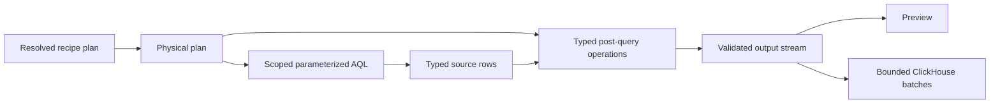
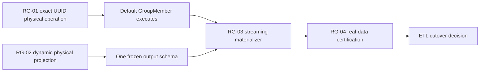

# Loom recipe remaining gaps plan

## Outcome

Close the final execution gaps in Loom's generic recipe path so the checked-in
default ACED recipe can run completely, publish bounded-memory ClickHouse
bundles, and be certified against the legacy Python DataFramer.

This plan covers four workstreams:

1. exact UUID3/UUID5 execution in the production physical path;
2. executable dynamic-column projection from a frozen resolved schema;
3. bounded streaming publication into atomic ClickHouse bundles; and
4. real-data parity and recovery certification.

The first three workstreams are implementation gaps. The fourth is the release
gate proving they compose correctly.

## Current implementation boundary

Loom now has:

- durable Arango-backed recipe registration and default recipe bootstrap;
- typed recipe parsing, semantic validation, resolution, and physical lowering;
- project/generation/authorization-scoped AQL row streams;
- GraphQL validate, explain, preflight, preview, materialize, and execution
  operations;
- durable bundle execution and logical-pointer records in Arango;
- staging-table ClickHouse publication with compare-and-swap visibility;
- exact Python-compatible UUID3/UUID5 behavior in the pure Go reference
  evaluator; and
- committed unit and conformance coverage for the generic compiler boundary.

Three production limitations remain:

- the AQL renderer rejects UUID3/UUID5 because its previous textual hash form
  was not RFC-compatible;
- resolved dynamic columns are visible during preflight but are not emitted by
  the physical row query; and
- the server materialization callback accumulates a complete output in memory
  before calling `InsertRows`.

The fail-closed behavior is correct. This plan replaces those stops with exact,
generic execution rather than weakening them.

## Non-negotiable invariants

1. No production code switches on recipe name, output name, or ACED resource
   type.
2. UUID output must match the pinned Python oracle byte-for-byte.
3. Recipe documents contain logical expressions only; no AQL, ClickHouse SQL,
   collection names, physical table names, or backend function names.
4. Dynamic columns are frozen before table creation or row execution.
5. Runtime rows cannot add columns absent from the resolved schema.
6. Discovery and projection use the same project, generation, authorization,
   traversal, source, key, and value semantics.
7. Preview and materialization consume the same physical output stream.
8. Materialization memory is bounded by configured batch and byte limits, not
   total output size.
9. A failed output rolls back the entire unpublished bundle.
10. Readers observe only a complete READY bundle through its logical pointer.
11. `recipeeval` remains a reference/conformance interpreter and is not called
    by production preview or materialization.
12. ETL cutover stays blocked until the real-data certification gate passes.

## Shared architectural decision: typed post-query operations

Not every exact recipe operation belongs in AQL. Add a small compiler-owned
post-query stage for operations that cannot be rendered exactly and safely by
the storage backend.

The execution shape becomes:



The post-query stage is not a general map evaluator. It accepts only validated,
typed physical operations emitted by the compiler. Its initial permitted uses
are:

- RFC-exact UUID3/UUID5 computation;
- dynamic-schema violation checks that cannot be raised safely inside AQL; and
- final row identity validation before a row reaches any consumer.

Every operation must declare input columns, output column, logical type, null
behavior, source recipe path, and deterministic execution order.

## RG-01: exact UUID3/UUID5 physical execution

Repository: Loom.

### Objective

Make UUID3/UUID5 usable by production preview and materialization without
reintroducing the incorrect `MD5/SHA1(CONCAT(text...))` AQL approximation.

This work unblocks the default `GroupMember` identity.

### Ownership

- `internal/dataframe/expression`: typed UUID call contract;
- `internal/dataframe/compiler/ir`: exact physical UUID operation;
- `internal/dataframe/compiler/lower`: backend capability selection;
- `internal/dataframe/compiler/render/aql`: source-argument projection only;
- `internal/dataframe/runtime` or `internal/dataframe/recipeengine`: typed
  post-query execution;
- `internal/dataframe/recipeeval`: oracle/reference implementation only; and
- `conformance/legacydataframer`: cross-runtime vectors and real fixture parity.

### Work package 01A: freeze the physical contract

1. Define one physical UUID operation with:
   - algorithm: UUID3 or UUID5;
   - namespace input;
   - ordered name-part inputs;
   - exact null propagation;
   - UTF-8 byte conversion;
   - RFC version and variant bits; and
   - lowercase canonical string output.
2. Preserve the already-verified legacy namespace behavior:
   - a UUID namespace value is consumed directly;
   - a string namespace is resolved with UUID3 under DNS namespace; and
   - name parts are concatenated in their declared order.
3. Reject unsupported namespace or argument types during semantic validation.
4. Record the recipe JSON path on the physical operation for diagnostics.
5. Mark the operation deterministic and side-effect free so the optimizer can
   safely retain or fold it.

### Work package 01B: add backend capability lowering

1. Introduce a renderer capability result for exact functions:
   - render natively;
   - project typed inputs and execute after query; or
   - unsupported.
2. Keep UUID3/UUID5 on the typed post-query path unless an Arango integration
   test proves an exact native implementation for arbitrary namespace bytes
   and Unicode names.
3. Have AQL return hidden, collision-safe source columns for the UUID inputs.
4. Execute the UUID operation before:
   - duplicate-identity checks;
   - preview row delivery;
   - ClickHouse batching; and
   - output row/byte accounting.
5. Remove hidden source columns before exposing logical rows.
6. Keep direct AQL UUID rendering fail-closed when the exact capability is not
   active.

### Work package 01C: identity semantics

1. Require a non-null UUID result when the operation supplies an output row
   identity.
2. Detect duplicate identities within one output execution.
3. Use the computed UUID as `__loom_row_id` for ClickHouse publication.
4. For stable source query ordering, order by the immutable source tuple used
   to compute the UUID; do not require AQL to order by a value it does not
   compute.
5. Confirm retry and pagination behavior remain deterministic for the same
   recipe, generation, scope, and resolved schema.

### Tests

- all committed Python UUID3/UUID5 oracle vectors;
- UUID namespace and string-derived namespace forms;
- ASCII, Unicode, empty, delimiter, and multi-part names;
- null namespace and null name-part behavior;
- malformed namespace and wrong-type diagnostics;
- constant-folded and row-derived UUID calls;
- hidden-column removal;
- duplicate computed identity rejection;
- default `GroupMember` identity parity; and
- repository scan proving the approximate textual hash renderer is unreachable.

### Acceptance gate

- production preview executes the default `GroupMember` output;
- every active UUID path matches the pinned Python vectors exactly;
- the final ClickHouse `__loom_row_id` matches the legacy membership identity;
- no approximate AQL UUID implementation is reachable.

## RG-02: dynamic-column physical projection

Repository: Loom.

### Objective

Turn the immutable columns in `ResolvedRecipePlan.ResolvedColumns` into ordered,
typed physical projections and reject discovery/execution disagreement.

### Ownership

- `internal/dataframe/semantic`: resolved source and frozen-column provenance;
- `internal/dataframe/compiler/lower`: resolved dynamic projection lowering;
- `internal/dataframe/compiler/ir`: physical dynamic projection nodes;
- `internal/dataframe/compiler/render/aql`: scoped source/key/value rendering;
- `internal/dataframe/recipeengine`: runtime schema enforcement; and
- `internal/dataframe/materialization`: exact schema consumption.

### Work package 02A: make the frozen schema executable

1. Extend each physical dynamic map with an ordered list of resolved columns.
2. Each resolved column must contain:
   - original discovered key;
   - sanitized output column name;
   - frozen logical type and cardinality;
   - dynamic-map identity;
   - source recipe path; and
   - collision policy provenance.
3. Include the ordered resolved columns in the physical-plan digest.
4. Reject physical lowering when a dynamic map has no resolved schema entry.
5. Reject duplicate sanitized names across static, traversal, and dynamic
   projections unless the declared collision policy defines the result.

### Work package 02B: render source/key/value semantics

1. Lower the dynamic source expression once per root or expanded row.
2. Bind the declared dynamic-item alias inside key and value expressions.
3. For every frozen original key, render one deterministic projection that:
   - selects matching source items;
   - applies the declared collision policy;
   - converts the value to its frozen logical type; and
   - emits null or the declared default when no item matches.
4. Preserve source collection order only when recipe semantics require it;
   otherwise sort matching items by a canonical stable representation before
   `first`, `coalesce`, or aggregation.
5. Never use the sanitized output name as the source lookup key.

### Work package 02C: enforce discovery/execution agreement

1. Carry the frozen original-key set into execution as compiler-owned bind
   data or typed physical metadata.
2. Detect a runtime source key that would produce a column absent from the
   frozen schema.
3. Detect values incompatible with the frozen logical type.
4. Return a structured error containing recipe, output, dynamic-map, source
   path, and offending key, without exposing AQL or authorization bindings.
5. Abort the complete preview or bundle on disagreement; never publish a
   partial schema.
6. Keep the discovery cache keyed by recipe digest, generation, scope digest,
   source identity, and schema algorithm version.

### Work package 02D: schema handoff

1. Expose static, traversal, identity, and resolved dynamic columns through one
   ordered output-schema descriptor.
2. Use that descriptor unchanged for:
   - GraphQL preflight;
   - preview column order;
   - ClickHouse table creation;
   - insertion binding; and
   - bundle execution metadata.
3. Map logical types to ClickHouse types in one package, including nullable and
   repeated values.
4. Remove the current server-local ad hoc ClickHouse column construction.

### Tests

- fixed allowed keys without discovery;
- scoped discovered keys for two projects, generations, and auth scopes;
- original-key versus sanitized-name lookup;
- key sanitization collisions under every supported policy;
- zero, one, and multiple matching source items;
- nested source paths and expansion-item sources;
- nullable, repeated, boolean, integer, decimal, string, code, UUID, date, and
  datetime values;
- runtime unexpected key and type drift;
- deterministic schema and row output under shuffled discovery/source order;
- identical preflight, preview, and ClickHouse column order; and
- absence of default output/resource-name dispatch.

### Acceptance gate

- a recipe with discovered dynamic columns previews and materializes through
  the production engine;
- no runtime row can alter the frozen table schema;
- discovery and execution disagreement fails the complete operation;
- preview and ClickHouse expose identical logical columns and values.

## RG-03: bounded streaming bundle materialization

Repository: Loom.

### Objective

Remove complete-output buffering from the GraphQL/server materialization path
while preserving all-output atomic publication.

### Ownership

- `internal/dataframe/materialization`: recipe bundle orchestration;
- `internal/dataframe/recipeengine`: reusable output streams;
- `internal/store/clickhouse`: typed batch insertion;
- `internal/dataframe/materialization/arango`: durable lifecycle and pointer
  metadata; and
- `internal/server`: dependency construction only.

### Work package 03A: move orchestration out of the server

1. Add a recipe bundle materializer service accepting:
   - a resolved execution identity;
   - ordered output stream descriptors; and
   - an `IdentityBundleStore`.
2. Move schema derivation, transaction control, batching, metrics, and GraphQL
   execution-model conversion out of `internal/server/server.go`.
3. Keep the server responsible only for constructing dependencies and wiring
   the GraphQL callback.
4. Resolve the recipe once per materialization request and reject a callback
   plan/digest mismatch.

### Work package 03B: bounded batching

1. Create every staging table from the frozen schema before consuming its
   stream.
2. Insert rows whenever either configured threshold is reached:
   - maximum rows per batch; or
   - maximum encoded bytes per batch.
3. Reuse batch storage after successful insertion so retained memory remains
   bounded.
4. Reject a single row larger than the configured maximum with an output and
   row-identity diagnostic.
5. Propagate context cancellation through stream callbacks and ClickHouse
   batch sends.
6. Make batch sizes configurable with conservative production defaults and
   explicit test overrides.

### Work package 03C: lifecycle, retry, and rollback

1. Persist state transitions before and after each visibility boundary:
   `PENDING -> LOADING -> VALIDATING -> READY` or `FAILED`.
2. Update row and byte counts after successful batch insertion.
3. On query, transform, validation, or insertion failure:
   - stop consuming all remaining streams;
   - mark the execution FAILED;
   - drop all staging tables created by the execution; and
   - leave the previous READY pointer unchanged.
4. Keep identical READY requests idempotent.
5. Reject or reconcile identical in-flight executions deterministically.
6. Preserve startup recovery for abandoned non-READY executions.

### Work package 03D: validation before publication

1. Confirm every declared output was created and completely streamed.
2. Confirm inserted schema exactly matches the resolved schema descriptor.
3. Confirm row identities are non-null and unique within each output.
4. Confirm persisted counts match inserted batch counts.
5. Advance the logical bundle pointer with compare-and-swap only after all
   outputs pass validation.

### Tests

- zero-row, one-row, exact-boundary, and multi-batch outputs;
- byte threshold reached before row threshold;
- oversized single row;
- cancellation during query and insertion;
- failure in first, middle, and final output;
- rollback failure diagnostics;
- retry after FAILED and idempotent retry after READY;
- concurrent identical and competing bundle publications;
- previous READY pointer retained on every failure path;
- bounded retained memory for a large synthetic stream; and
- execution row/byte metrics equal inserted data.

### Acceptance gate

- materialization does not retain a complete output in memory;
- peak row-buffer memory is bounded by configured batch limits;
- injected failures never expose a partial bundle;
- GraphQL execution status reflects durable bundle state and counts.

## RG-04: real-data certification and cutover evidence

Repositories: Loom and the ETL checkout.

### Objective

Prove the production recipe path, including exact UUIDs, dynamic projection,
streaming publication, and recovery, against a pinned real META corpus and the
legacy Python implementation.

### Work package 04A: freeze the oracle corpus

1. Pin the `gen3_util` revision used as the legacy oracle.
2. Commit or reproducibly generate a representative META corpus containing:
   - all five default outputs;
   - at least one `GroupMember` UUID identity;
   - every legacy expression/value shape represented by the default recipe;
   - dynamic-map keys, sanitization collisions, and type variation if dynamic
     maps are part of the default or certification recipe; and
   - empty, missing, repeated, and malformed boundary cases.
3. Record input file digests, oracle revision, Python version, recipe digest,
   and expected output manifests.
4. Generate immutable Python NDJSON goldens before running Loom comparison.

### Work package 04B: production-path comparison

For the same project and generation, compare:

```text
META -> pinned Python DataFramer -> NDJSON oracle
META -> Loom load -> recipe preview -> direct Loom rows
META -> Loom load -> recipe materialize -> ClickHouse logical bundle rows
```

Compare exactly:

- output set and output names;
- row counts and row identities;
- ordered columns;
- scalar and array JSON types;
- null versus missing behavior;
- UUID values;
- dynamic-column names and values; and
- deterministic results across a repeated execution.

### Work package 04C: recovery and scale gate

1. Run a dataset large enough to force multiple batches for every non-empty
   output.
2. Capture peak process memory and verify it remains within the configured
   batch envelope plus a documented fixed overhead.
3. Inject one failure after at least one successful batch and verify:
   - the execution becomes FAILED;
   - staging tables are removed or reconciled;
   - the prior READY pointer remains active; and
   - a retry publishes one complete bundle.
4. Restart Loom during an in-flight execution and verify startup reconciliation.

### Work package 04D: ETL cutover decision

1. Produce a machine-readable parity report containing all compared digests
   and mismatch counts.
2. Require zero unexplained mismatches for direct preview and ClickHouse.
3. Document performance, memory, and recovery results beside the parity report.
4. Only after this gate passes, create the separate ETL change removing:
   - Loom NDJSON export back into the Python DataFramer;
   - Python DataFramer runtime dependencies; and
   - Elasticsearch publication if ClickHouse becomes the accepted consumer.

### Acceptance gate

- all five default outputs match the pinned Python oracle exactly;
- direct Loom and logical ClickHouse reads match each other exactly;
- the large fixture proves bounded-memory publication;
- failure and restart tests preserve the previous READY bundle;
- the parity report contains zero unexplained mismatches.

## Recommended execution order



Implementation sequence:

1. Land the typed post-query operation boundary and exact UUID execution.
2. Carry frozen dynamic columns through physical lowering and row projection.
3. Consolidate the output schema descriptor used by preflight, preview, and
   ClickHouse.
4. Extract the materializer service and change it to bounded batches.
5. Run the real META parity, scale, failure, and restart gates.
6. Decide ETL cutover in a separate change after the evidence is recorded.

RG-01 and the semantic/IR portion of RG-02 can proceed in parallel. RG-03
depends on the unified schema descriptor from RG-02. RG-04 depends on all three
implementation workstreams.

## Merge strategy

Use small vertical merges that keep the existing generation load/export,
GraphQL dataframe, recipe, and materialization paths green:

1. typed post-query operation IR and validation;
2. exact UUID post-query execution plus oracle vectors;
3. resolved dynamic-column physical model;
4. dynamic AQL projection and disagreement checks;
5. unified ordered output schema descriptor;
6. recipe bundle materializer service extraction;
7. bounded row/byte batching;
8. lifecycle, retry, rollback, and recovery hardening;
9. real direct-preview parity;
10. real ClickHouse parity, scale, and recovery report.

Every merge must run:

```bash
GOCACHE=/tmp/loom-gocache GOTOOLCHAIN=auto go test ./...
go vet ./graphqlapi ./internal/dataframe/... ./internal/server
git diff --check
```

UUID and dynamic-projection merges must run their committed differential
vectors. Materialization merges must additionally run integration tests against
real ArangoDB and ClickHouse.

## Definition of done

- The complete default recipe previews and materializes through the production
  compiler path.
- `GroupMember` UUID identities exactly match the pinned Python implementation.
- Resolved dynamic columns are physically emitted and cannot drift at runtime.
- Preflight, preview, and ClickHouse use one ordered frozen schema descriptor.
- Materialization memory is bounded independently of total output row count.
- Every failure path retains the previous READY logical bundle.
- Real direct and materialized outputs exactly match the pinned Python oracle.
- No production package imports `recipeeval` or dispatches on default output or
  resource names.
- The ETL cutover remains a separate evidence-backed change.
