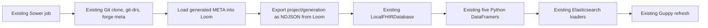

# Loom database-only ETL migration

## Scope

Make one change: replace GRIP as the raw FHIR database with Loom.

Everything after raw-resource retrieval stays as it works today:

- `LocalFHIRDatabase` and SQLite;
- the five existing `gen3_tracker.meta.dataframer` generators;
- existing column prefixing;
- existing Elasticsearch deletion and loading;
- Guppy refresh;
- current Sower action, packet, logging, authorization, Git/DRS hydration, `forge meta`, Gecko config upload, and cleanup.

ClickHouse and Loom-native dataframe recipes are explicitly out of scope for this branch.

The follow-on work required to replace the Python DataFramer with Loom-native,
backwards-compatible default recipes is specified in
[LOOM_DEFAULT_DATAFRAMER_RECIPE.md](LOOM_DEFAULT_DATAFRAMER_RECIPE.md). That
work is intentionally separated from this database-only migration so the raw
database cutover can ship and be validated independently.

The implementation foundations are now present, but the remaining production
compiler, discovery, registry, materialization, parity, and cutover work is
specified in
[LOOM_RECIPE_PRODUCTION_COMPLETION_PLAN.md](LOOM_RECIPE_PRODUCTION_COMPLETION_PLAN.md).

The five remaining executable integration gaps are decomposed into code-level
work packages and acceptance gates in
[LOOM_RECIPE_FINAL_INTEGRATION_PLAN.md](LOOM_RECIPE_FINAL_INTEGRATION_PLAN.md).

The final implementation closure work for exact physical UUIDs, executable
dynamic columns, bounded ClickHouse streaming, and real-data certification is
specified in
[LOOM_RECIPE_REMAINING_GAPS_PLAN.md](LOOM_RECIPE_REMAINING_GAPS_PLAN.md).

## Target flow



The replacement boundary in `fhir_import_export.py` is narrow:

```text
remove: grip_delete → bulk_load_raw → get_project_data
add:    loom_load_dataset → loom_export_dataset
keep:   LocalFHIRDatabase.bulk_insert_data onward
```

## Current Loom gap

The inspected Loom checkout has the internal generation-aware loader and a `load-generation` CLI. Its HTTP server currently registers `/graphql` and the legacy single-file `/api/v1/imports`; it does not register a complete-generation load route or an NDJSON export route.

This migration therefore needs two small Loom HTTP contracts. Bulk byte transfer should use streaming HTTP, not GraphQL.

### Load

```http
POST /api/v1/datasets/{project}/generations/{generation}
Authorization: bearer ...
Content-Type: multipart/form-data
```

The request contains the complete generated `META/*.ndjson` set. Loom reuses its existing generation loader and returns the READY/active generation plus counts. A retry of the same project, generation, and content digest must be idempotent.

### Export

```http
GET /api/v1/datasets/{project}/generations/{generation}/export
Authorization: bearer ...
Accept: application/x-ndjson
```

The response streams the original FHIR resource documents for that exact generation. Ordering is not significant. It must exclude Loom edges, catalogs, lifecycle records, and internal generation/auth fields.

The export can be one mixed NDJSON stream because `LocalFHIRDatabase.bulk_insert_data` dispatches by each record's `resourceType`. A tar of per-resource NDJSON files is also acceptable, but adds no value to this ETL.

## WP-01: add the two Loom routes

Repository: `/Users/peterkor/Desktop/BMEG/loom`

1. Wrap the existing generation load service in the streaming load route.
2. Add an authenticated export service that streams raw FHIR documents scoped by project and generation.
3. Resolve or validate the generation explicitly; never export across generations.
4. Preserve the original resource JSON and remove Loom-private storage fields from export.
5. Test authorization, incomplete upload, retry, generation mismatch, empty dataset, streaming cancellation, and round-trip resource equality.

Acceptance gate: loading a fixture and exporting it produces the same set of `(resourceType, id, JSON)` resources as the input fixture.

## WP-02: replace GRIP calls in this repo

Repository: this checkout.

1. Add a small Loom HTTP client using the existing `ACCESS_TOKEN`.
2. In `_load_all`, replace `grip_delete` and per-file `bulk_load_raw` with one complete Loom generation load.
3. Replace `get_project_data(...)` with the streaming Loom export iterator passed to `LocalFHIRDatabase.bulk_insert_data(...)`.
4. Keep the generator map, field prefixes, Elasticsearch delete/load calls, error behavior, and Guppy refresh unchanged.
5. Generate a deterministic generation ID from the project, Git commit, and/or META digest so Sower retries are safe.
6. Replace the GRIP portion of `_empty_project` only if Loom provides a retire/delete operation. Until that contract exists, keep `method=delete` explicitly unsupported for Loom rather than pretending Elasticsearch-only deletion removed the raw dataset.
7. Remove `aced_submission.grip_load` imports and `GRIP_GRAPH_NAME` use. Do not remove `aced_submission.meta_flat_load` or `gen3_tracker`.

Tests:

- unchanged Sower input packet;
- mocked load and streaming export;
- exported resources passed intact into `LocalFHIRDatabase`;
- the same five DataFramer generators and Elasticsearch calls run;
- load/export failure stops before Elasticsearch deletion;
- token and request-body redaction;
- workspace cleanup on success and failure.

## WP-03: compatibility proof

Run the same fixture through both raw-database paths:

```text
baseline: META → GRIP → get_project_data → DataFramer
candidate: META → Loom → export → DataFramer
```

Compare the five prefixed generator outputs before Elasticsearch:

- row counts;
- row IDs;
- exact column names;
- exact JSON values and types;
- missing/null behavior.

Because the Python DataFramer code is unchanged, any difference should be traceable to Loom load/export fidelity rather than a second translation implementation.

## Definition of done

- The current Sower packet launches the same job code and Git/DRS flow.
- Raw FHIR resources are written to and read back from Loom; the job makes no GRIP calls.
- The existing Python DataFramer produces equivalent output for all five indices.
- Elasticsearch and Guppy behavior remain unchanged.
- No ClickHouse client, materialization API, or Loom recipe is introduced.
- The Docker image retains DataFramer/Elasticsearch dependencies but no longer needs GRIP client code or `GRIP_GRAPH_NAME`.
